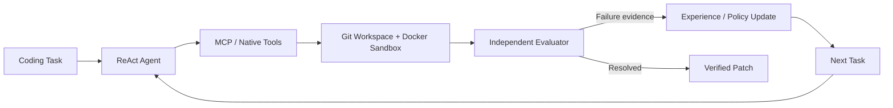

# 自进化代码修复 Agent / Self-Evolving Coding Agent

> **EvoDev** 是一个面向 Python 代码修复的 ReAct Coding Agent：它可以自主检索代码、生成补丁并运行测试；项目研究的重点不是训练模型，而是能否从历史失败轨迹中沉淀经验，再用独立评测判断这些经验是否真正改善后续行为。

[技术报告](docs/TECHNICAL_REPORT.md) · [V2 评测复盘](docs/evaluation_v2.md) · [环境与运行指南](docs/setup.md) · [V1 冻结结果](results/final-v1/summary.json)

## 为什么做这个项目

许多 Coding Agent Demo 只证明“模型会调用工具”，但没有回答三个更难的问题：代码是否真的修对、失败能否转化为后续经验、所谓改进能否经受样本外评测。EvoDev 围绕这三个问题构建了完整闭环：

- **隔离代码执行**：ReAct Agent 通过 MCP / Native Tools 操作一次性 Git Workspace，测试在禁网、限资源的 Docker Sandbox 中运行。
- **独立结果评测**：Evaluator 在全新 Workspace 中重新应用最终 Patch，并依次检查语法、隐藏目标测试和回归测试，避免 Agent 自己评自己。
- **评测驱动演进**：只从 Train 失败中生成 Experience 或受约束 Policy Candidate，由 Validation Gate 决定接受、拒绝或回滚，Test 不参与调参。

| 可核验结果 | 结论 |
|---|---|
| **V1 冻结实验** | 3 个 Test 任务，每题重复 3 次；Baseline 6/9，Experience、Policy、Combined 均为 8/9 |
| **V2 更严格验证** | 5 个 Test 任务，每臂每题重复 2 次；Baseline 与 Candidate 均为 3/10，未观察到净成功率提升 |
| **Runtime Guardrail** | Train-only 定向实验中，Patch 失败后未重读目标文件就实际继续 Patch 的次数由 9 降至 0 |
| **工程验证** | 当前测试套件实际收集 **367 tests**；冻结的 V1 结果可离线复验 36 Runs、36 Evaluations 和 4 Figures |

## 关键结果

### V1：小规模探索性结果

V1 Benchmark 共 12 个任务，按 6 Train / 3 Validation / 3 Test 划分。冻结 Test Set 包含 **3 个任务**，每个 Variant 对每题重复 **3 次**，因此每组共 **9 次运行**：

| Variant | Experience | Evolved Policy | Resolved | Resolution Rate |
|---|:---:|:---:|---:|---:|
| Baseline | No | No | 6 / 9 | 66.67% |
| Experience | Yes | No | 8 / 9 | 88.89% |
| Policy | No | Yes | 8 / 9 | 88.89% |
| Combined | Yes | Yes | 8 / 9 | 88.89% |

V1 的组间结果支持 Experience 和 Policy **各自可能带来收益**，但没有证明组合使用存在额外增益。该结果只有 3 个独立 Test 任务，差异集中在 `task_010`，因此只能作为探索性信号，不能表述为统计显著或通用编码能力提升。


### V2：更严格的验证与失败分析

V2 将任务扩展为 18 个，按 8 Train / 5 Validation / 5 Test 划分，并加强隐藏测试、数据冻结和预注册运行约束。主要结论是：

1. 更严格的 Validation 与 Final Test 中，没有观察到 Experience 对最终任务成功率的稳定净收益；V2 Final 的 Baseline 与 Candidate 均为 **3/10**。
2. Failure Analysis 发现 Agent 会在 Patch 失败后，不重新读取当前文件就继续重复修改，并可能在最后编辑后没有留下测试步骤。
3. 项目因此加入 Runtime Guard：Patch 失败后必须重新读取对应目标文件，最终修改后必须运行测试，并为固定步数预算保留验证窗口。
4. 在预先冻结的 Train-only 定向实验中，实际执行的该类无效重复 Patch 从 **9 次降至 0 次**。
5. 该结果证明的是 Guardrail 的阻断机制真实生效；由于样本很小、exact McNemar `p=1.0`，且成本没有改善，不能声称总体成功率得到因果提升。

完整实验阶段、对照条件和证据索引见 [V2 评测复盘](docs/evaluation_v2.md)。

## 系统架构



一条任务的实际路径是：Agent 读取公开问题与仓库，通过结构化工具完成搜索、修改和测试；Evaluator 不信任 Agent 的最终回答，而是在干净环境中重新验证 Patch；只有 Train 失败可以进入经验提取或策略候选生成，候选必须通过外部门禁后才能用于后续任务。

## 关键设计

### 显式 ReAct Coding Loop

Agent 在每一轮根据真实 Tool Observation 决定下一步，支持文件检索、分段读取、Unified Diff Patch、Git Diff 和受限 pytest。状态、上下文裁剪、工具错误与终止条件均由项目代码显式管理，便于测试和审计。

### 有边界的工具与沙箱

Native 与 MCP Provider 共用同一 Tool Contract。模型不能执行任意 Shell；文件路径必须位于当前 Workspace，测试容器默认禁网、只读 rootfs、移除 Linux Capabilities，并限制 CPU、内存、PID 和超时。

### 独立 Evaluator

Evaluator 从原始仓库创建 Fresh Workspace，只应用最终 Patch，然后按 `Patch → Syntax → Hidden Target Tests → Hidden Regression Tests` 分层判定。任务失败与环境失败分别统计，失败运行不会因影响指标而被删除或选择性补跑。

### Experience 与 Policy 演进

Experience 是从 Train 失败中提取的结构化长期行为记忆，使用任务类别、关键词和 Trigger 做轻量检索；当前实现不是向量数据库 RAG。Policy 只允许修改三个受控字段，并依次经过 Schema、Smoke 和 Pairwise Validation Gate。解决率优先于 Token、步骤和延迟，成本下降不能覆盖质量退化。

### 可复验而不是只展示成功案例

运行轨迹记录公开的模型用量、Tool Call/Result、错误与最终 Patch，不保存私有思维链。Manifest 固定代码、Benchmark、模型配置、Sandbox、Policy、Experience 和 Run ID；V1 的 Summary、CSV、独立评估报告与图表可以离线重算和校验。

## 技术栈

| 方向 | 技术 |
|---|---|
| Agent | Python 3.11、ReAct、Pydantic、OpenAI-compatible API / DeepSeek |
| Tool Use | MCP Python SDK、Native Tool Provider、Function Calling |
| Execution | Git Disposable Workspace、Docker Sandbox、pytest |
| Evaluation | Hidden Target / Regression Tests、Pairwise Gate、Manifest / SHA-256 |
| Experience | SQLite、冻结 JSON Snapshot、结构化与词法检索 |
| Engineering | Conda、pip、Ruff、Matplotlib、Git |

## Quick Start

以下路径只复验仓库中已提交的 V1 结果，**不需要 API Key、Docker 或网络，也不会产生模型费用**：

```powershell
conda env create -f environment.yml
conda activate evodev
python -m pip install -e ".[dev]"

evodev-final --project-root . --config configs/experiments/final-v1.yaml verify
```

预期关键输出：

```json
{
  "verified_runs": 36,
  "verified_instances": 36,
  "verified_figures": 4,
  "valid": true
}
```

完整的 Windows、Docker、密钥配置、测试命令和真实 Agent 运行方式见 [环境与运行指南](docs/setup.md)。

## Evaluation / Benchmark

| 版本 | 数据划分 | 最终评测 | 主要用途 |
|---|---|---|---|
| V1 | 6 Train / 3 Validation / 3 Test | 4 Variants × 3 Tasks × 3 Runs = 36 Runs | 验证执行、评测与 Experience/Policy 演进闭环 |
| V2 | 8 Train / 5 Validation / 5 Test | 2 Arms × 5 Tasks × 2 Runs = 20 Runs | 提高任务难度，检验 Experience 泛化与 Runtime Guardrail |

两版 Benchmark 都遵循以下边界：Repository Template 不跨 Split；Agent 看不到 Task YAML、Gold Patch 和 Hidden Tests；Validation 只用于选择候选；Test 冻结后不再用于调参；所有预注册运行无论成功或失败都进入独立评测。

当前结论边界也很明确：V1 和 V2 都是自建的小型 Python 修复集，尚未覆盖 SWE-bench、大型真实仓库、多语言或线上服务；V2 Final 未证明 Candidate 优于 Baseline；Docker Sandbox 也不应视为恶意代码的完整安全边界。

## 项目结构

```text
EvoDev/
├── src/evodev/          # Agent、LLM、Tools、Experience、Evaluation
├── mcp_servers/         # DevTools MCP stdio Server
├── benchmarks/          # V1：12 个任务
├── benchmarks-v2/       # V2：18 个任务及冻结 QA
├── docker/sandbox/      # 隔离测试镜像
├── policies/            # Policy 候选、Champion 与版本链
├── experiences/         # 冻结 Experience Snapshot
├── evolution/           # Failure Evidence 与 Gate 结果
├── experiments/         # V2 公开实验摘要和证据清单
├── results/final-v1/    # V1 冻结结果、评估实例与图表
├── tests/               # 367 项自动化测试
└── docs/                # 设计、评测与环境文档
```

## 详细文档

- [完整技术报告：Task 1–14 与实现细节](docs/TECHNICAL_REPORT.md)
- [Benchmark V2：实验设计、结果与结论边界](docs/evaluation_v2.md)
- [环境配置、Docker 与运行指南](docs/setup.md)
- [V1 机器可读 Summary](results/final-v1/summary.json)
- [V1 逐次运行结果](results/final-v1/summary.csv)
- [V1 冻结实验 Manifest](results/final-v1/experiment_manifest.json)
- [V2 Final Test 公开报告](experiments/benchmark-v2-final-test-v1/README.md)
- [V2 Runtime Guardrail 定向实验](experiments/benchmark-v2-experience-guardrails-paid-v1/README.md)

真实模型运行会产生 API 费用，所有相关 CLI 都要求显式付费确认；默认测试和离线结果复验不会调用模型。
