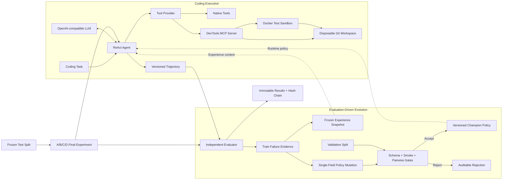

# EvoDev

**An Evaluation-Driven Self-Evolving ReAct Coding Agent**

EvoDev 是一个面向软件开发任务的单 Agent 研究型项目。它在底层 LLM 固定、
不进行模型微调的前提下，从失败轨迹中提取可复用 Experience，并在受约束的 Policy
空间内通过独立评测完成候选生成、验证、晋升与回滚。

> 核心问题：Coding Agent 能否通过可审计的评测闭环改进自身行为，而不只是增加 Prompt 技巧？

项目已完成 Final v3.0 的 14 项任务，包含可安装 Python 包、MCP 工具服务、Docker
Sandbox、12 题受控 Benchmark、独立 Evaluator、Experience/Policy 演化，以及冻结的
36-run A/B/C/D 最终实验。

[完整技术报告](docs/TECHNICAL_REPORT.md) ·
[最终实验数据](results/final-v1/summary.json) ·
[冻结实验清单](results/final-v1/experiment_manifest.json)

## 核心结果

在冻结 Test Set 上，每个 Variant 对 3 个任务各运行 3 次：

| Variant | Experience | Evolved Policy | Resolved | Resolution Rate |
|---|:---:|:---:|---:|---:|
| A · Baseline | No | No | 6 / 9 | 66.67% |
| B · Experience | Yes | No | 8 / 9 | 88.89% |
| C · Policy | No | Yes | 8 / 9 | 88.89% |
| D · Combined | Yes | Yes | 8 / 9 | 88.89% |

Experience 与 Policy 分别比 Baseline 提高 **22.22 个百分点**。B、C、D 在 Primary
Metric 上并列，因此当前结果支持二者各自有效，但不足以证明额外的组合增益。


## 系统架构



数据边界固定为：

- **Train（6题）**：失败轨迹、Reflection、Experience 与 Mutation Evidence；
- **Validation（3题）**：Champion/Candidate 的 3×3 Pairwise Gate；
- **Test（3题）**：冻结后仅用于最终 A/B/C/D 实验；
- Repository Template 不跨 Split，Hidden Tests 与 Gold Patch 对 Agent 不可见。

当前公开结果仍基于冻结的 Benchmark v1。Benchmark Loader 与 Baseline、Experience、
Evolution、Single Task、Final Experiment 入口已支持通过 `--benchmark-root` 选择独立版本；
每个新版本使用 `benchmark.yaml` 声明版本、任务总数、Split 和类别配额，不覆盖 v1 历史数据。
另有 4 题 [Benchmark v2 Pilot](benchmarks-pilot-v2/README.md) 完成离线 QA 与 8-call 付费
难度校准；总体 3/8 Accepted，没有题目被两种策略同时解决。基于该结论，正式 V2 的
8 道 Train、5 道 Validation 与 5 道 Test 均已完成分 Split 和统一库存离线 QA，正式 Manifest
已冻结。正式 Baseline 预案已固定为仅运行 8 道 Train、每题重复 2 次，共 16 次付费调用；
Validation/Test 仍保持未暴露。该预案尚未执行，因此 V2 仍无策略效果结论。

## 工程亮点

- **完整 Coding Loop**：读取、搜索、补丁、Git Diff、测试与多轮错误恢复；
- **统一工具层**：Native/MCP Provider 使用同一 Canonical Tool Contract；
- **隔离执行**：Disposable Workspace + Docker，默认禁网、只读 rootfs 和资源限制；
- **独立评测**：在 Fresh Workspace 中应用 Patch，分层执行 Target/Regression Tests；
- **可审计演化**：Train-only Evidence、单字段 Mutation、Schema/Smoke/Pairwise Gate；
- **防结果漂移**：Manifest、Policy、Experience、Summary 和 Figure 均带版本或 Hash；
- **失败不回填**：最终实验禁止选择性补跑，`AGENT_ERROR` 作为有效失败保留；
- **工程验证**：301 项测试，Ruff 与依赖一致性检查通过。

## 30 秒离线验证

要求 Python 3.11。验证已提交的最终实验不需要 API Key、Docker 或网络：

```powershell
conda env create -f environment.yml
conda activate evodev
python -m pip install -r requirements-dev.txt
python -m pip install -e .

evodev-final --project-root . --config configs/experiments/final-v1.yaml verify
```

预期输出：

```json
{
  "experiment_id": "final-v1",
  "verified_runs": 36,
  "verified_instances": 36,
  "verified_figures": 4,
  "summary_matches": true,
  "csv_matches": true,
  "valid": true
}
```

运行自动化测试与静态检查：

```powershell
python -m pytest
python -m ruff check .
python -m pip check
evodev-benchmark-qa --benchmark-root benchmarks-v2
```

无需 Docker 或 API Key 即可检查 V2 Train Baseline 的冻结运行矩阵：

```powershell
evodev-baseline --project-root . --benchmark-root benchmarks-v2 `
  --experiment-id exp-baseline-v2-train-v1 --repetitions 2 --split train --plan
```

真实执行还必须增加 `--confirm-paid`，且只有收到单独的付费授权后才会进行。

## 项目结构

```text
EvoDev/
├── src/evodev/          # ReAct Agent、LLM、Policy、Experience、Evaluation
├── mcp_servers/         # DevTools MCP stdio Server
├── benchmarks/          # 6 Train + 3 Validation + 3 Test
├── benchmarks-pilot-v2/ # 4 题 V2 离线校准集，非正式 Test
├── benchmarks-v2/       # 已冻结正式 V2：18 题、完整 QA 与 Manifest
├── docker/sandbox/      # 隔离测试镜像
├── policies/            # Candidate、Champion 与版本索引
├── evolution/           # Proposal、Gate 与 Generation 状态
├── experiences/         # 冻结 Experience 快照
├── experiments/         # 开发实验与 Benchmark v2 Pilot 审计摘要
├── results/final-v1/    # 36-run 最终结果、实例证据与图表
├── tests/               # 自动化测试
└── docs/                # 完整技术报告
```

## 关键设计

### Resolution-first Gate

候选策略必须先通过 Schema 和 Smoke Gate。Pairwise Validation 要求 Champion/Candidate
在相同条件下各完成 9 次有效运行：解决率优先于效率；成功率下降时，Token 节省不能推动晋升；
成功率持平时，只有 Token 与至少一项辅助成本指标都显著改善才可接受。

### Frozen Final Experiment

最终实验固定模型、温度、Benchmark Hash、Sandbox Digest、工具目录、Policy/Experience Hash
和 36 个唯一 Run ID。已有部分结果时拒绝续跑，必须升级 Experiment Version 后全量执行。
所有已提交结果可由 `verify` 从原始产物重新计算。

### Failure-aware Engineering

`final-v1` 中一次模型工具参数 JSON 截断被保留为 `AGENT_ERROR`，没有人工补跑。后续代码为
同类错误增加了一次有限重试并累计重试 Token；冻结历史数据不被修复后的行为改写。

## 局限性

- Final Test Set 只有 3 个 Python 任务，不宣称统计显著性或通用 Coding 能力；
- V2 Pilot 只有 4 题 × 2 Policy × 1 次重复，不能作为策略优劣或能力提升证据；
- 成功率改善集中在 `task_010`，尚未完成 SWE-bench 或大型真实仓库评测；
- Experience 快照当前只有一个 Train 来源经验，检索采用结构化与词法匹配；
- Policy Search Space 人工限制为三个字段，没有进行模型微调；
- B、C、D 在 Primary Metric 上并列，尚无 Experience 与 Policy 额外互补增益的证据；
- Docker Sandbox 面向受控 Coding Task，不应视为恶意代码的完整安全边界。

## 进一步阅读

- [完整 Task 1–14 技术报告](docs/TECHNICAL_REPORT.md)
- [最终结果 Summary](results/final-v1/summary.json)
- [逐次运行数据](results/final-v1/summary.csv)
- [Benchmark Manifest](benchmarks/manifest.json)
- [Benchmark v2 Pilot](benchmarks-pilot-v2/README.md)
- [Benchmark v2 付费 Pilot 结果](experiments/benchmark-v2-pilot-v1/README.md)
- [Benchmark v2 正式任务蓝图](docs/BENCHMARK_V2_BLUEPRINT.md)
- [Benchmark v2 Train QA](benchmarks-v2/train-qa.json)
- [Benchmark v2 Validation QA](benchmarks-v2/validation-qa.json)
- [Benchmark v2 Test QA](benchmarks-v2/test-qa.json)
- [Benchmark v2 正式 Manifest](benchmarks-v2/manifest.json)
- [Benchmark v2 正式冻结 QA](benchmarks-v2/formal-qa.json)
- [Benchmark v2 Train Baseline 预案](docs/BENCHMARK_V2_BASELINE_PLAN.md)
- [Benchmark v2 Train Baseline 配置](configs/experiments/benchmark-v2-train-baseline-v1.yaml)
- [当前 Champion Policy](policies/policy-v003.yaml)
- [Evolution State](evolution/evolution-v1/progress.json)

真实模型运行会产生 API 费用，必须显式确认；默认测试和上述离线验证不会调用模型。
