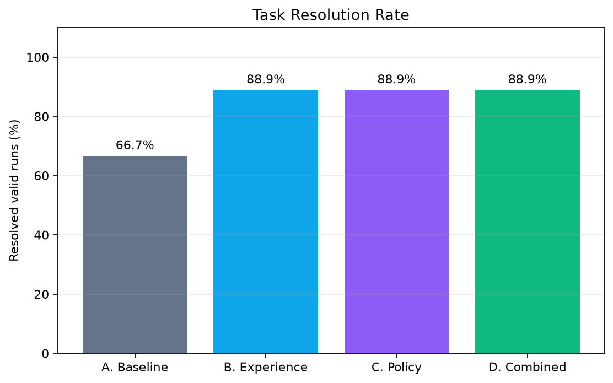
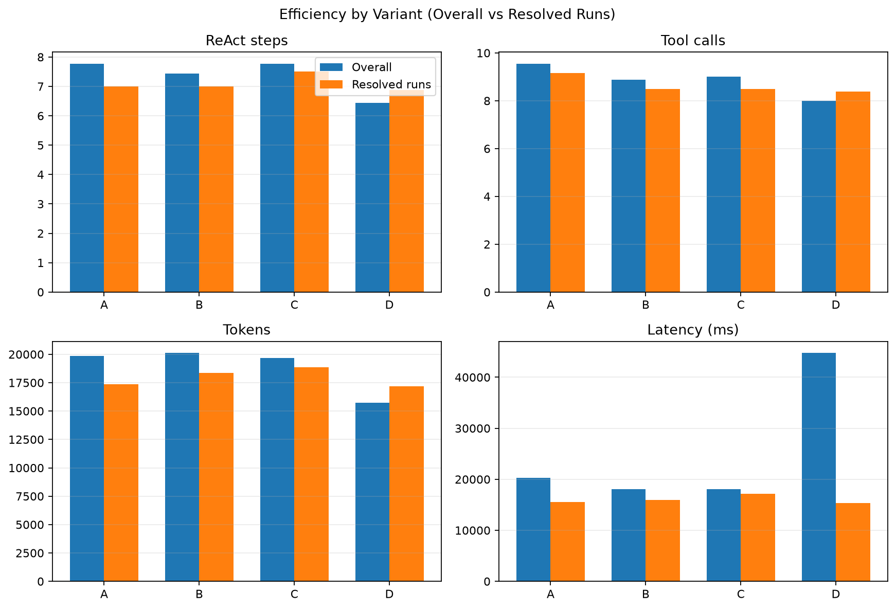

# EvoDev

**EvoDev: An Evaluation-Driven Self-Evolving ReAct Coding Agent**

EvoDev 是一个面向软件开发任务的单 ReAct Agent。项目研究在底层 LLM 固定、
不进行模型微调的前提下，能否通过失败轨迹提取 Experience，并在受约束的 Policy
空间内进行可验证演化，从而提高编码任务解决率。

核心主线：`Build → Act → Measure → Improve → Prove`。

## 当前状态

当前已完成：

- **Task 1：Project Initialization**
- **Task 2：ReAct Loop + Native Tool Calling**
- **Task 3：Simplified Agent Harness**
- **Task 4：DevTools MCP Server**
- **Task 5：MCP Client + Dynamic Tool Discovery**
- **Task 6：Docker Sandbox + 完整 Coding Loop**
- **Task 7：Lightweight Trajectory Logging + Trace Analyzer**
- **Task 8：Benchmark v1.0（12 Tasks）**
- **Task 9：Independent Evaluator + Fixed-Policy Baseline**
- **Task 10：Reflection + Experience Extraction**
- **Task 11：Experience Retrieval + Controlled Experiment**
- **Task 12：Constrained Policy Space + File Versioning**
- **Task 13：Offline Evolution Engine + Accepted/Rejected Case Studies**
- **Task 14：Final Evolution Experiment + CLI Demo**

Final v3.0 规划中的 14 项任务已全部完成。

现有能力：

- `src/` 可安装 Python 包骨架；
- YAML 与环境变量配置加载；
- `TaskSpec`、`ModelTurn` 等基础 Schema；
- OpenAI-compatible `LLMClient`，默认配置为 DeepSeek；
- 工具参数不是合法 JSON 对象时最多重试一次，并累计重试请求的 Token 用量；
- 基础日志与真实模型 smoke 命令；
- 显式单 ReAct Tool Calling Loop；
- 可替换 `ToolProvider` 与 `NoOpEventSink`；
- `list_files`、`read_file`、`search_code`、`apply_patch`、`git_diff`、
  `run_tests` 六个 Native Tool；
- workspace 路径边界、结构化 ToolResult 和错误归一化；
- 基于官方 MCP Python SDK 2.x 的 DevTools stdio Server；
- Unified Diff 应用、Git Diff 获取和受控 pytest 路径/selector 执行；
- `fixtures/simple_bug` 的失败测试、补丁、diff、测试通过闭环；
- 可连接、断开和手动刷新的 `MCPToolProvider`；
- 支持分页发现与缓存的 Canonical `ToolSpec` Catalog；
- MCP Result 到 Canonical `ToolResult` 的归一化及分层错误统计；
- `AgentState` 统一任务生命周期和 Working Memory；
- `ContextManager` 基于字符预算确定性保留/压缩上下文；
- 仅针对只读、幂等工具瞬时错误的受限 Retry；
- 项目级 `FakeLLM` 与 `fixtures/simple_read` 开发 Fixture；
- 版本化 Run Metadata、追加式事件日志、Artifact 引用与崩溃恢复；
- 落盘前密钥脱敏，以及五项可复算 Trace Feature；
- 12 题受控 Python Coding Benchmark、严格 Loader 与 Agent 可见性隔离；
- Before-Fail / After-Gold-Pass QA、Task Checksum 与 Manifest Hash；
- Fresh Workspace + Docker 的独立分层 Evaluator 与失败分类；
- 受控实验 Manifest、指标汇总，以及冻结的 `exp-baseline-v1`；
- Train-only Experience Store、`experience-v001` 冻结快照与受限 Top-K 检索；
- Relevant/Random Validation 对照实验与 Retrieval/Utilization 指标。
- 仅含三个可演化字段的强类型 `AgentPolicy` 与代码层 Frozen Invariants；
- Soft Guidance、PreToolCall Hard Guard 和 Policy 驱动的 ReAct Step Limit；
- Train-only Failure Pattern Aggregation、单字段 Mutation 与可校验文件版本链。
- Task 13 离线 Evolution Engine：Train-only Proposal、三层 Gate、搜索预算与回滚；
- 六个真实 Pairwise Case Studies：四个 Rejected Candidate 与两个 Accepted Mutation；
- 当前 Champion `policy-v003`，在保持 Validation Resolution 的同时将 `max_react_steps` 降至 10。
- Task 14 严格 A/B/C/D 2×2 配置、Final Manifest Preflight、只读冻结协议、固定
  36-run Runner、Result Artifact Writer、CLI Demo、Benchmark QA CLI、Final Artifact
  追溯校验、四张自动 PNG 图表与 Overall/Resolved-run 双口径汇总。
- `final-v1` 已在冻结 Test Set 上完成 36/36 次有效评测：Baseline 为 6/9，Experience、
  Policy 与 Combined 均为 8/9；全部 Result Artifact 与图表已通过离线追溯校验。

真实模型 smoke call 需要本地 `LLM_API_KEY`，未配置密钥时不会自动调用或产生费用。

Task 13 已完成实现与真实案例验收。`candidate-004` 将 Resolution 从 4/9 提升到 6/9，晋升
为 `policy-v002`；Task 14 前置演化中的 `candidate-006` 在 Resolution 保持 6/9 时显著降低
Tokens、Steps 与 Tool Calls，晋升为 `policy-v003`。当前进入 Generation 4，代内 Candidate
为 0/2、连续无提升为 0/2，且没有 pending Candidate；Task 14 已满足 2 Accepted + 1 Rejected
Case 前置条件，后续不再继续演化。

## 环境

- Python 3.11
- Conda 管理基础环境
- pip 管理项目依赖
- Docker Desktop 或等价 Docker Engine（Task 6 起需要）

```powershell
conda env create -f environment.yml
conda activate evodev
python -m pip install -r requirements-dev.txt
python -m pip install -e .
```

已有环境只需执行后两条 pip 命令。

主要运行时依赖包括 OpenAI-compatible SDK、Pydantic、PyYAML、python-dotenv 和
`mcp>=2.1,<3`；完整版本约束以 `requirements.txt` 为准。

Task 6–13 没有新增 Python 依赖。Docker 必须能够同时访问 Client 与 Server：

```powershell
docker version
```

首次使用前，在项目根目录构建无运行时联网需求的测试镜像：

```powershell
docker pull python:3.11-slim
docker build -f docker/sandbox/Dockerfile -t evodev-python:3.11 .
```

镜像构建属于 Repository Preparation，可能需要联网拉取基础镜像和 pytest；Agent
执行测试时使用 `--pull never` 和 `--network none`，不会自由下载依赖。

## Disposable Workspace 与 Docker Sandbox

`WorkspaceManager` 将 Original Repository 复制到 `runs/run_<id>/workspace`，初始化独立
Git baseline，并支持：

- `create()`：创建当前 Run 独占的 workspace 与 artifacts 目录；
- `reset()`：恢复 baseline 并清除 workspace 内新增文件；
- `cleanup()`：先在 Run 根目录保存 `final.patch` 与 `final.diff`，再只删除 disposable workspace。

每次 `run_tests` 都启动一个具名的一次性容器。固定边界包括：

- 只挂载当前 disposable workspace 到 `/workspace`；
- `--network none`、`--pull never`、`--cap-drop ALL`；
- `no-new-privileges`、只读 rootfs，不挂载 Docker Socket；
- CPU 1、Memory 1 GiB、PID 128、默认超时 60 秒；
- 完整 stdout/stderr 写入 Run Artifact，模型侧只返回 20,000 字符以内的 head/tail。

超时后 runner 使用容器名执行强制删除并通过 `docker inspect` 复查。Sandbox 默认配置在
`configs/sandbox.yaml`。基础镜像只预装 pytest；其他 Benchmark 依赖应在准备阶段写入
镜像，运行阶段不允许自由 `pip install`、`curl` 或 `wget`。

## DevTools MCP Server

从项目根目录启动 stdio Server，并将工具限制在指定 workspace：

```powershell
python -m mcp_servers.devtools.server --workspace D:\path\to\workspace
```

该命令从 Task 6 起默认让 `run_tests` 进入 Docker。仅限本地开发、明确不需要隔离时可加
`--local-tests`；它不属于正式 Coding Run。

Server 暴露六个结构化工具：

- 只读：`list_files`、`read_file`、`search_code`、`git_diff`；
- 写入：`apply_patch`，仅接受 workspace 内的 Unified Git Diff；
- 执行：`run_tests`，仅接受测试路径与受限 pytest selector，不接受 Shell 命令。

当前 `run_tests` 通过 Task 6 的 Docker Sandbox 执行，并具有资源限制、超时、输出截断
与容器清理保证；`--local-tests` 仅用于明确选择的本地开发场景。

Agent 侧使用 `MCPToolProvider` 连接 Server；首次连接会分页发现工具并缓存，ReAct 每步
读取缓存，`refresh_tools()` 可显式刷新：

```python
from mcp import StdioServerParameters

from evodev.agent import ReActAgent
from evodev.tools import MCPToolProvider

server = StdioServerParameters(
    command="python",
    args=["-m", "mcp_servers.devtools.server", "--workspace", str(workspace_path)],
)
with MCPToolProvider(server) as tools:
    agent = ReActAgent(llm=llm, tool_provider=tools)
    result = agent.run(task)
```

`MCPToolProvider` 和 `NativeToolProvider` 实现同一个同步 `ToolProvider` 接口；MCP SDK
对象不会进入 ReAct 主循环。连接、超时、协议和 Server 退出错误与工具执行错误分别
计数，避免后续 Evaluation 把基础设施故障误判为 Agent 策略失败。

## Trajectory 与 Observability

每次运行使用独立的 `runs/run_<id>/` 目录，包含：

```text
run.json
events.jsonl
final.patch
final.diff
trace_features.json
artifacts/
```

`TrajectoryRecorder` 应在创建 `ReActAgent` 前初始化并作为 `event_sink` 注入。`run.json`
记录 Agent、Policy、Experience、模型、Prompt、工具目录、Benchmark 与 Sandbox 的版本或
哈希；工具目录哈希与工具发现顺序无关。`events.jsonl` 只持久化以下七类公开事件：

- `RUN_STARTED`、`MODEL_TURN`、`TOOL_CALL`、`TOOL_RESULT`；
- `FINAL_ANSWER`、`RUN_FINISHED`、`RUN_ERROR`。

`TOOL_CALL` 与 `TOOL_RESULT` 通过 `call_id` 关联。大输出写入 `artifacts/`，事件只保留
`artifact_ref`、`sha256`、`chars` 和 `truncated_for_llm`。Recorder 在落盘前过滤已知
API Key、Authorization Header、`.env` 密钥和值及常见 token/key 模式；disposable
workspace 也不会复制 `.env`。清理 workspace 时可传入相同过滤器：

```python
manager.cleanup(run, redact=recorder.redactor.redact_text)
```

事件采用 append、flush 与 `fsync`；重启时会截去尾部不完整 JSON 行并从下一序号继续。
`TraceAnalyzer` 仅从公开事件复算 `searched_before_edit`、`inspected_tests_before_edit`、
`unique_files_read`、`patch_attempts` 和 `test_runs`。轨迹格式版本为 `1.0`，不记录模型的
私有思维链。

## Benchmark v1.0

冻结的 Benchmark 位于 `benchmarks/`，包含恰好 12 个 Python Coding Tasks：

| Split | 数量 | 用途 |
|---|---:|---|
| Train | 6 | 失败轨迹、Reflection、Experience 与 Mutation Evidence |
| Validation | 3 | Candidate Policy Accept / Reject |
| Test | 3 | 最终报告，不参与调优 |

类别配额固定为 Bug Fix 4、Exception Handling 2、Feature 2、Refactoring 2、Test
Repair 2。每个任务包含 `task.yaml`、`repo/`、Hidden Target/Regression Tests 和
`gold.patch`。`BenchmarkLoader.create_agent_workspace()` 只从 `repo/` 创建 disposable
workspace，因此 Agent 看不到任务元数据之外的 Hidden Tests 与 Gold Patch。

`benchmarks/manifest.json` 冻结每题规范化 SHA-256 Checksum 和全局 Manifest Hash。
Loader 会验证 6/3/3 split、类别配额、Task ID 唯一性、必需资产以及同一 Repository
Template 不跨 split。运行 Benchmark QA：

```powershell
python -m evodev.benchmark.validate
# 或安装后的等价入口
evodev-benchmark-qa
```

其中 12 个参数化用例分别在独立临时 Git workspace 中验证：

```text
Original Repository + Hidden Evaluation -> FAIL
Original Repository + Gold Patch + Hidden Evaluation -> PASS
```

### Versioned Benchmark Root

Benchmark v1 的声明式库存合同位于 `benchmarks/benchmark.yaml`，其内容与原冻结的
12 题、6/3/3 Split 和类别配额一致，因此 `benchmarks/manifest.json` 的历史 Hash 不变。
Loader 不再把版本、任务总数和类别写死在 Schema 中，而是从所选 Benchmark Root 的
`benchmark.yaml` 读取并验证；缺少该文件的旧 v1 副本仍使用原 12 题合同兼容加载。

Baseline、Reflection、Experience、Evolution Evidence/Train/Pairwise Validation、Single
Task 和 Final Experiment 均接受独立的 Benchmark Root。命令行入口使用：

```powershell
evodev-benchmark-qa --benchmark-root benchmarks
evodev-baseline --benchmark-root benchmarks --experiment-id exp-baseline-v1 --confirm-paid
evodev-evolve --benchmark-root benchmarks collect-train `
  --experiment-id exp-policy-train-v1 --repetitions 2 --confirm-paid
```

Final Experiment 在配置文件中使用 `benchmark_root`；该逻辑路径同时进入新实验 Manifest。
旧 Manifest 缺少该字段时按 `benchmarks` 解析，因此已冻结的 `final-v1` 仍可离线复核。
Final Runner 的计划长度由冻结 Test Task 数量计算，不再写死为三题或 36 次运行；v1 仍自然
产生 36 次，计划中的 v2 五题在三次重复、四个 Variant 下产生 60 次。以上兼容层不引入
新依赖，Benchmark v2 题目与 Pilot 运行属于下一独立阶段。

### Benchmark v2 Pilot 离线资格验证

`benchmarks-pilot-v2/` 保存 4 道不进入正式 V2 Test 的校准题。目录中的 2/1/1 Split
只是复用通用 Loader 的完整库存合同；校准后合格题只考虑迁入正式 Train，正式
Validation/Test 使用新的未调试任务。当前任务为：

| Task | 主题 | 难度 | 源码文件 | Public | Hidden Target / Regression | Gold 修改文件 |
|---|---|---|---:|---:|---:|---:|
| `task_101` | locale/tax 请求参数完整参与缓存键 | Medium | 5 | 2 | 2 / 2 | 2 |
| `task_102` | 不透明 cursor 的多页与空页遍历 | Medium | 4 | 2 | 2 / 2 | 1 |
| `task_103` | CLI/env/file/default 优先级与类型转换 | Medium | 5 | 2 | 4 / 3 | 2 |
| `task_104` | 多行库存预留的异常补偿 | Hard | 5 | 2 | 2 / 3 | 1 |

所有原始仓库的 Public Tests 均通过，避免把公开测试直接作为失败位置提示；完整 Hidden
Evaluation 在原始仓库失败，应用 Gold Patch 后通过。最终 Pilot Manifest Hash 为
`6143ff702fffaf4f29b96ac65c222b85214ecaa6fa51cc777b623418a79285b1`。相同 Hash 的完整
QA 使用五个独立临时根重复执行，5/5 轮均为 4/4 valid。

此外，`tests/test_pilot_benchmark.py` 为每题构造两种合理但不完整的修复，共 8 个负向
变体，例如只把 locale 或 tax 放入缓存键、只修配置优先级、只回滚最后一条库存记录。
Hidden Target/Regression Tests 对 8/8 变体均返回失败，防止测试只会接受 Gold 正例。
离线 QA 只使用 Python 标准库和现有 pytest，不依赖 Docker，也未调用模型。

### Benchmark v2 Pilot 付费难度校准

离线资格验证通过后，在 Git Commit
`def7814a5ee234f3b7a61124adc09455a6162678` 上冻结执行 8 次 Agent Call：
`policy-v001` Baseline（15 步上限）与 `policy-v003` Champion（10 步上限）分别对四题运行
一次，均关闭 Experience。模型固定为 DeepSeek `deepseek-v4-flash`、temperature 0.1；
Benchmark Hash、Docker Image Digest、Tool Catalog Hash 与 8 个 Run ID 写入
`experiments/benchmark-v2-pilot-v1/manifest.json`。实验不选择性补跑，8/8 均进入独立评测。

| Variant | Resolved | Resolution Rate | Avg Steps | Avg Tokens | Avg Latency |
|---|---:|---:|---:|---:|---:|
| Baseline · `policy-v001` | 2 / 4 | 50% | 13.00 | 100,867 | 65.3 s |
| Champion · `policy-v003` | 1 / 4 | 25% | 10.00 | 62,039 | 49.1 s |

逐题上，task_101 仅 Champion 通过，task_102 和 task_104 仅 Baseline 通过，task_103 两者均未
通过；总体 3/8，且没有题目被两种策略同时解决。因此 Pilot 排除了“题目太简单”的担忧，
四题可保留为正式 V2 Train 候选难度锚点，但不能进入已参与校准之外的 Validation/Test。

该结果不支持 Champion 优于或劣于 Baseline 的稳定结论。Champion 的平均步骤、Token 和延迟
更低，但解决数也更低，说明 10 步上限可能在复杂任务上产生提前截断风险；四题、每格一次的
样本不足以分离模型随机性、题目构成和 Policy 效应。8 次轨迹合计 651,625 tokens；公开轨迹
未保存供应商账单与价格表，因此不推断货币成本。机器可读摘要位于
`experiments/benchmark-v2-pilot-v1/summary.json` 与 `summary.csv`。

### Benchmark v2 正式任务蓝图

Pilot 校准后冻结正式 V2 的 18 题设计合同：8 Train / 5 Validation / 5 Test，类别配额为
Cross-module Bug 4、State/Data Flow 3、Feature 3、Error Resilience 3、Concurrency/Resource 2、
Test Repair/Compatibility 3。四道 Pilot 题统一迁入 Train 候选；正式 Validation/Test 共十道题
全部使用无 Agent 历史运行的新 Repository Template。

机器可读蓝图位于 `configs/benchmarks/v2-blueprint.yaml`，逐题固定故障机制、Hidden Target、
Regression Focus 和 Gold Patch 最小范围。task_101–108、task_109–113 和 task_114–118 已分别
完成 Train、Validation 与 Test QA，并在后续完整库存 QA 通过后生成正式
`benchmarks-v2/manifest.json`。最终蓝图状态为 `benchmark_frozen`，完整任务表见
`docs/BENCHMARK_V2_BLUEPRINT.md`。

### Benchmark v2 Train 实现与离线 QA

正式 V2 的 8 道 Train 题已完成：task_101–104 从 Pilot 原样迁移，task_105–108 分别实现乱序
分片组装、跨模块订阅按比例计费、有序有界并行映射和 Transport 协议兼容适配。新题均包含
Repository、Public Tests、Hidden Target/Regression Tests 和最小 Gold Patch。

Train 专项测试共 25 项：验证 8/8 原始 Public Tests 通过、8/8 原始 Hidden Evaluation 失败、
8/8 应用 Gold 后通过，并对四道新题各构造两种 Gold 退化，共 8/8 被 Hidden Tests 拒绝。
考虑 task_107 的线程调度，完整专项 QA 使用独立临时根重复 5 轮，5/5 轮均为 25/25 通过。
规范化任务树哈希和机器可读阶段结果位于 `benchmarks-v2/train-qa.json`。

该阶段没有生成正式 Benchmark Manifest：当时 Validation task_109–113 与 Test task_114–118
尚未实现，`benchmarks-v2/` 故意不提供 `benchmark.yaml`，避免通用 Loader 将部分库存当作完整 V2。

### Benchmark v2 Validation 实现与离线 QA

正式 V2 的 5 道 Validation 题 task_109–113 已独立完成，覆盖时区安全的 Token 过期判断、连续
ACK Checkpoint、HTTP ETag 条件刷新、保留主异常的资源清理和版本化序列化兼容。每题均包含
Repository、Public Tests、Hidden Target/Regression Tests 和最小 Gold Patch。

Validation 专项测试共 21 项：验证 5/5 原始 Public Tests 通过、5/5 原始 Hidden Evaluation
失败、5/5 应用 Gold 后通过，并对每题构造两种 Gold 退化，共 10/10 被 Hidden Tests 拒绝。
完整专项 QA 使用独立临时根重复 5 轮，5/5 轮均为 21/21 通过。该阶段 Agent Runs 为 0，
Paid Debugging 为 false；规范化任务树哈希和机器可读阶段结果位于
`benchmarks-v2/validation-qa.json`。

该阶段仍不生成正式 Benchmark Manifest：当时 Test task_114–118 尚未实现，避免部分库存被
误当作完整 V2。Validation 的实现与 Gold 只用于离线资格验证，不构成 Agent 或 Policy 效果结论。

### Benchmark v2 Test 实现与离线 QA

正式 V2 的 5 道 Test 题 task_114–118 已独立完成，覆盖层级权限解析、稳定依赖安装顺序、仅瞬态
错误重试、可取消 Async Worker Pool 和 Plugin Hook 签名兼容。每题均包含 Repository、Public
Tests、Hidden Target/Regression Tests 和最小 Gold Patch。

Test 专项测试共 21 项：验证 5/5 原始 Public Tests 通过、5/5 原始 Hidden Evaluation 失败、
5/5 应用 Gold 后通过，并对每题构造两种 Gold 退化，共 10/10 被 Hidden Tests 拒绝。完整专项
QA 使用独立临时根重复 5 轮，5/5 轮均为 21/21 通过，其中包含异步超时、父任务取消、Worker
失败和 Semaphore 释放路径。该阶段 Agent Runs 为 0，Paid Debugging 为 false；规范化任务树
哈希和机器可读阶段结果位于 `benchmarks-v2/test-qa.json`。

此时 18 道题均已完成各 Split 离线资格验证，随后进入完整库存冻结。

### Benchmark v2 正式库存冻结

`benchmarks-v2/benchmark.yaml` 固定 18 题、8/5/5 Split 和六类题目配额；通用
`BenchmarkLoader` 验证 task_101–118 连续身份、18 个唯一 Repository Template、跨 Split 零
泄漏，并按规范化 LF 内容计算逐题任务树 SHA-256。正式 `manifest.json` 的全局 Hash 为
`c5ad46d8963400db6f31eeee64a0abe5029eeb1a4cee8e308af6a3e5f6c92ee6`。

统一 `evodev-benchmark-qa --benchmark-root benchmarks-v2` 对 18/18 题再次确认原始 Hidden
Evaluation 失败、Gold 后通过；完整库存测试还为每道题创建 Agent Workspace，确认私有评测资产
不可见，并核对三份 Split QA 的 18 个 checksum 与 Manifest 完全一致。正式阶段证据位于
`benchmarks-v2/formal-qa.json`。

该阶段 Agent Runs 与付费调用均为 0，只能证明 Benchmark 的完整性、可判别性和隔离边界，不能
证明 Baseline、Experience 或 Evolved Policy 在 V2 上的效果。

### Benchmark v2 Train Baseline 预案

正式 Baseline 的目的不是给出最终性能，而是在不接触 Validation/Test 的前提下收集固定策略的
Train 失败证据。运行矩阵固定为 task_101–108 × 2 次重复，共 16 次 Agent Run；模型为 DeepSeek
`deepseek-v4-flash`，temperature 0.1，`fixed-react-v1`，最多 15 个 ReAct Step，上下文预算
60,000 字符，Experience 关闭。所有有效失败必须保留，不允许选择性补跑。

`evodev-baseline` 新增 Split 过滤、静态 `--plan` 与 `--confirm-paid` 门禁。下面的命令只验证
Benchmark Hash、配置和确定性 Run ID，不启动 Docker，也不调用模型：

```powershell
evodev-baseline --project-root . --benchmark-root benchmarks-v2 `
  --experiment-id exp-baseline-v2-train-v1 --repetitions 2 --split train --plan
```

根据 8-call Pilot 的 589,813 input / 61,812 output tokens 线性外推，16-call 预估为
1,179,626 input / 123,624 output tokens。按 2026-09-02 DeepSeek 官方
`deepseek-v4-flash` cache-miss 价格估算，低峰约 0.3411 美元、峰值约 0.6822 美元；再按
Token 翻倍的峰值压力场景为 1.3644 美元，因此单轮授权上限固定为 2.00 美元。实际账单以供应商
用量和执行时有效价格为准，正式运行前必须重新核价、完成 Docker 与环境身份预检，并获得单独的
付费授权。机器可读配置位于 `configs/experiments/benchmark-v2-train-baseline-v1.yaml`；该预案
随后于 Git Commit `e02b7ece0d0494cf89b42b975a1f601395ca28f7` 上完整执行，16/16 个
预定 Run ID 均进入独立评测，没有选择性补跑。

| 指标 | V2 Train Baseline |
|---|---:|
| Resolved | 6 / 16 |
| Resolution Rate | 37.5% |
| 两次均解决的任务 | 3 / 8 |
| Average ReAct Steps | 13.5625 |
| Average Tool Calls | 20.875 |
| Average Tokens | 157,204.6875 |
| Average Latency | 111.891 s |
| Search Before Edit | 75% |
| Test Inspection Before Edit | 100% |

task_101、102、104 均为 2/2 Resolved，task_103、105、106、107、108 均为 0/2，说明五道
Train 题提供了跨重复稳定的失败证据。16 次轨迹合计 2,515,275 tokens；按执行时段峰值且全部
input cache miss 保守估算为 1.3054 USD，低于 2.00 USD 授权上限，但不作为实际供应商账单。
冻结条件、逐次指标与边界位于 `experiments/benchmark-v2-train-baseline-v1/`。Validation/Test
未访问，因此本轮不能说明演化收益，也不是正式最终性能分数。

### Benchmark v2 Train Failure Evidence

确定性 `evodev-evolve aggregate` 对 10 个 Baseline 失败 Run 做 Train-only 聚合：4 个
`TARGET_TEST_FAILED`、4 个 `REGRESSION_FAILED`、1 个 `AGENT_MAX_STEPS` 符合 Reflection
资格；`run_task_108_r01` 的 `SYNTAX_ERROR` 不在当前资格集合中。聚合报告新增总失败、eligible
失败与排除项的显式记账，因此非 eligible 失败不再静默消失。完整机器可读结果位于
`evolution/benchmark-v2/failure-patterns-baseline-v2-train-v1.json`。

逐 Run 审计将主要根因归为：4 次需求维度覆盖不完整、2 次实现未收尾、2 次破坏注入资源的
生命周期契约、1 次步数耗尽且无最终 Patch、1 次修改测试后留下语法错误。10/10 失败 Run 均在
编辑前搜索并检查测试，所以当前证据不支持继续优先变异 `inspect_tests_before_edit` 或
`prefer_search_before_read`；`max_react_steps` 有更直接的候选依据，但仍必须经过 Validation Gate。
详细证据与推断边界位于 `evolution/benchmark-v2/failure-audit-v1.json`。

本阶段只读取 Train 轨迹并离线聚合，模型调用与新增费用均为 0。其后的 Reflection 阶段在单独
授权下对 9 个 eligible Run 各调用一次模型：8 条通过本地安全校验，首个
`run_task_103_r01` 候选因复制 evaluator-specific literals 被拒绝且未重试。后 8 次已保留
调用共使用 18,956 input tokens 与 28,806 output tokens；首个拒绝调用的 usage 未被旧 runner
持久化，因此不伪造九次调用的精确 token 或账单总额。

V2 Reflection 入口在正式执行前补充 `--plan` 与 `--confirm-paid`：静态计划会验证 Benchmark
身份、独立数据库、eligible/skip 集合和最多调用数，不创建 SQLite Store，也不调用模型；真实运行
缺少显式确认时在 API 之前拒绝。冻结执行配置位于
`configs/experiments/benchmark-v2-reflection-v1.yaml`。

合格输出经离线人工审计后，将 task_107 两次重复的 injected-executor lifecycle 经验归并为一条，
同时保留两个 Reflection Provenance；最终冻结 7 条 active Experience 和 8 个来源到
`experiences/experience-v002.json`，Canonical Hash 为
`8eb3a05d7a1c7aa655688b74f050951234fb2133dc8183b1c2566c05aa1ae5dd`。快照只含相对路径，
完整调用记账与合格 Reflection 位于 `experiments/benchmark-v2-reflection-v1/`。本结果只证明
Train→Reflection→Experience 链路完成，尚不代表 Validation 或 Test 性能提升。

### Benchmark v2 Experience Validation 预检

正式付费对照前，`evodev-experience-audit` 只使用 Validation 的公开 task metadata 和公开
repository files 重放冻结检索，不读取 hidden tests、Gold Patch 或 Test split。`experience-v002`
在 task_109–113 上只命中 task_113，覆盖率 1/5；该题注入 1 条 Experience、992 字符，其余
四题 Relevant Prompt 与 Baseline 相同。完整确定性输出位于
`experiments/benchmark-v2-experience-validation-plan-v1/retrieval-audit.json`。

因此 5 题 × 2 repetitions × Baseline/Relevant 的 20-call 计划被标记为
`blocked_before_paid_execution`，没有启动 Docker 或模型调用。现有
`evodev-experience-experiment` 同时补齐 `--plan` 与 `--confirm-paid`，并去除 Experience
Metrics 对 v1 Baseline 路径的硬编码；缺少确认时会在 Runner、Docker 和 API 之前退出。

预检暴露的通用设计问题是 Experience 的 `task_types` 来自模型自由文本，而 Retriever 的类别
强匹配依赖与 Benchmark category 完全一致。后续只能依据 Train source category 修复这一元数据
契约，并以 Train leave-one-task-out 审计验证；不能根据本次 Validation 的具体题意修改关键词，
否则会污染用于 Gate 的数据。机器可读计划位于
`configs/experiments/benchmark-v2-experience-validation-v1.yaml`。

### Benchmark v2 Train Experience 元数据修复

Validation 预检之后没有依据 Validation 题意调整检索器。修复只使用 `experience-v002` 的
Train Provenance 与对应公开 `task.yaml`：保留模型生成的语义 `task_types`，再追加可信源任务
category。`ReflectionExtractor` 对未来候选自动执行相同规则；历史快照通过确定性
`add_source_task_types` 迁移为 `experience-v003`，7/7 active Experience 均包含源 category，
recommendation、rationale、confidence、时间戳和 8 个 Sources 均保持不变。新 Hash 为
`53f8ce05c569b94f2969aacff64c43a799b19adec52cdad07a1f59611f1006e9`。

Train leave-one-task-out 审计中，v002 为 0/8、v003 为 1/8。总体比例低是因为同任务来源会被
防泄漏规则排除，且只有 task_101 的 category 在另一任务 task_106 中存在 Experience；在这个
唯一可验证的 cross-task category-supported holdout 上，命中由 0/1 提升到 1/1，并选择两条
来自 task_106 的经验。该结果证明可信 category 契约生效，不证明广泛覆盖。审计文件位于
`experiments/benchmark-v2-experience-metadata-v1/train-retrieval-audit.json`；文件读取测试确认
本阶段没有访问 Validation/Test、hidden tests 或 Gold Patch，也没有模型调用与新增费用。

### Benchmark v2 Experience v003 Validation Gate

为避免看到 Validation 处理覆盖后继续调参，v003 的审计规则、输入 Hash、Retriever Git Blob、
规范化 SHA-256 与参数先提交于 Git `9224f0a`，随后才执行唯一一次决策型公开元数据审计。预设
通过条件为命中不少于 4/5 任务、至少选择 3 条不同 Experience、单题注入不超过 2,500 字符，
且数据边界检查全部通过。

实际结果命中 4/5，选择 6 条不同 Experience，单题最大注入 1,913 字符；task_110 因冻结库存
没有 `state_data_flow` 来源经验而未命中。结果满足全部预设条件，状态记为
`ready_for_paid_authorization`。这只证明 Relevant arm 相对 Baseline 具有足够的处理差异，不证明
Experience 改善了 Agent 成功率。

从该 Gate 起，Retriever、v003 快照、任务类别、阈值和排序参数全部锁定；任何修改都必须创建
新的实验版本，不能复用本次判定。审计原始输出和机器可读清单位于
`experiments/benchmark-v2-experience-validation-v2/`。本阶段模型调用与付费调用均为 0，未启动
Docker，也未访问 hidden tests、Gold Patch 或 Test split。若另行获得明确付费授权，后续固定为
5 题 × 2 repetitions × Baseline/Relevant 两个 arms，共 20 次调用，禁止选择性补跑。

### Benchmark v2 Experience 正式 Validation 对照

用户明确授权后，执行条件、官方价格、2.00 USD 上限和两条命令先冻结于 Git `789f83a`。
DeepSeek `/models` 确认 `deepseek-v4-flash` 可用，Docker Desktop 29.7.2 可用；Baseline 和
Relevant preflight 均固定 5 题 × 2 次、`fixed-react-v1`、temperature 0.1、15 步、60,000
字符上下文、相同 Tool Catalog、Sandbox Digest 和 Benchmark Hash。代码级
`assert_controlled_conditions` 验证除 Experience 字段外没有差异。

20/20 runs 均完成独立评测且全部有效，没有选择性补跑。Baseline 为 4/10 Resolved（40%），
Relevant 为 3/10（30%），表面 delta 为 -10 pp。配对结果为 Baseline win 1、Relevant win 0、
tie 9，双侧 exact McNemar p=1.0。唯一不一致是 task_110 r01，而该题恰好是 v003 未检索到
Experience 的任务；四个检索命中任务共 8 对，Baseline 与 Relevant 都是 2/8，零个 discordant
pair。因此没有证据证明 Experience 提升成功率，也不能把总体下降归因为 Experience。

Relevant 的 Retrieval Hit 为 8/10，但只有 2 个 run 含 Trace Analyzer 可测的 behavior target，
且相对 Baseline 的新增目标行为为 0/2，利用率 0%。这把瓶颈从 Retrieval Coverage 进一步定位到
Behavioral Utilization：Train-only category 修复让经验能够被取回，但当前经验表示与 Prompt
消费机制没有产生可观察的新行为。

两组合计 2,773,058 input 和 279,610 output tokens。执行发生在 DeepSeek 非峰时段，按所有
input 均为 cache miss 的公开单价保守估算 0.7946 USD，低于授权上限；该值不是供应商账单。
冻结摘要、逐次结果、原始 Hash 和比较位于
`experiments/benchmark-v2-experience-validation-paid-v1/`。完整轨迹与 Docker 输出仅在本地
gitignored 目录保存；Test split 未运行，hidden tests 与 Gold Patch 未暴露给 Agent。

本阶段不接受 Experience 净收益假设，也不依据 Validation 继续修改 Retriever、v003 或补跑。
若继续研究，应只在 Train 创建新的可执行/可测经验消费机制，并使用新的实验版本重新立项。

### Benchmark v2 Train-only Experience 消费合同

后续没有从 Validation 题意、逐题 Patch 或 hidden tests 继续调 Retriever，而是回到已有 Train
Experience，修复更一般的消费与测量契约。v003 的自然语言 `Trigger/Prefer/Why` 只能通过
“test/search before”等短语启发式推导两个布尔目标，导致大多数 Retrieval Hit 无法进入
Utilization 分母；同时 Agent Prompt 没有明确的执行阶段。

`experience-v004` 在不修改原 recommendation、rationale、task types、confidence、时间戳和
8 个 Sources 的前提下，为 7/7 active Experience 增加 `Inspect → Act → Verify` 合同和 16 个
公共轨迹目标。目标只使用既有五项 Trace Feature 与 `eq/gte/lte` 运算，因而无需保存模型思维链
或解析自由文本。新 Hash 为
`f71ac3984674ba98e52ae02fd939dbc5bf2d4ad998a7013b547ff756f6054988`。

为保护历史 Gate，锁定的 `retrieval.py` 未修改，规范化 SHA-256 仍为
`bb1f50b47462d0d5f8f5af84dc9efd3332d3e493902b79dc72ab128d182499d2`。新
`ContractExperienceRetriever` 独立渲染合同；含合同的快照使用 `execution-contract-v1`，旧快照
继续使用 `legacy-v1`。consumer 版本进入 Preflight、Experiment Manifest 和 Run Metadata。

指标现在区分 Measurable、Adherent 与 Utilized：Treatment 满足某条合同的全部目标才算
Adherent；Treatment 达成而配对 Baseline 未达成才算 Utilized。Train leave-one-task-out 仍是
1/8，task_101 选择两条来自 task_106 的合同，Prompt 1,177 字符；没有为了提高覆盖率扩大关键词。
完整审计位于 `experiments/benchmark-v2-experience-consumption-v1/`。

本阶段没有模型调用、Docker、Validation/Test 访问或新费用，只证明新合同可执行、可测和向后
兼容，不构成成功率提升。任何后续付费 Train 对照都必须先冻结新方案并获得新的明确授权。

### Benchmark v2 Experience v003/v004 Train Holdout

为避免在七个无检索命中的 Train 任务上浪费调用，本轮按已冻结的 leave-one-task-out 审计只选择
唯一有跨任务 Experience 命中的 `task_101`。方案在提交 `280afbd` 预先锁定：v003 与 v004 各
运行 2 次，共 4 次调用；模型、温度、Policy、步数、上下文、top-k、Sandbox Digest、工具目录、
任务和 Run ID 全部相同，只允许 Snapshot 与 Consumer 改变。同任务来源 Experience 由 Retriever
自动排除，Validation/Test 不读取，hidden tests 只由独立评估器在 Agent 结束后使用。

| 指标 | v003 | v004 |
|---|---:|---:|
| Accepted | 1 / 2 | 1 / 2 |
| 同一套 v004 合同遵循 | 2 / 2 | 1 / 2 |
| v004 增量利用 | — | 0 / 2 |
| 平均 Tokens | 143,138.5 | 108,923.5 |
| 平均 Tool Calls | 26.0 | 22.0 |
| 平均延迟 | 97.1 s | 70.2 s |

r01 是 v004 胜、r02 是 v003 胜，双侧 exact McNemar p=1.0。v004 r01 虽 Accepted，但没有执行
测试，不满足选中合同；r02 满足合同却出现 Syntax Error。因此本轮再次分离了结果、行为遵循与
增量利用三个概念。v004 的 Token、Tool Call 与延迟下降是描述性信号，但一题两次无法证明
因果效率改善。实际保守费用估算为 0.1302 美元，无补跑。冻结摘要和证据 Hash 位于
`experiments/benchmark-v2-experience-train-holdout-paid-v1/`。

### Benchmark v2 Experience v005 Runtime Guardrails

对上述四条公开轨迹按统一事件算法重算后，v003 两次共 10 次 Patch、6 次失败、3 次未检查重试；
v004 两次共 16 次 Patch、11 次失败、8 次未检查重试。v004 r01 的 10 次 Patch 中 7 次失败，
全部在下一次 Patch 前没有重新读取当前文件，最终 15 步耗尽且 `test_runs=0`。v004 r02 的四次
Test Calls 中只有三次实际执行，最终保留不完整函数体并产生 Syntax Error。检索选择和合同渲染
均正常，因此根因是 Prompt 无法控制工具顺序与验证预算，而不是 Retrieval Miss。

本轮拒绝只加强文案的 text-only v005，改用默认关闭、由快照显式激活的运行时门禁：

- `inspect_after_patch_failure` 在 `PATCH_APPLY_FAILED` 后阻止再次 Patch，直至成功 `read_file`；
- `verify_after_last_edit` 在最后成功编辑未经测试时拒绝 Final Answer；
- 倒数第二步已有未验证编辑时只允许测试，最后一步禁止创建无法再验证的新 Patch。

`experience-v005` 是 v004 的确定性 guardrail-only 迁移：7/7 Experience 启用编辑后验证，仅具备
对应恢复合同的 `exp_242f9076fcdd413085a70c719c9a07fc` 启用 Patch 失败恢复。recommendation、
rationale、task types、行为目标与 Sources 均不变，Canonical Hash 为
`622a19135c144e1e9a8b1d787933add4a8299491888e6e31463c1bbc18919602`，consumer 升级为
`execution-contract-v2`。v001–v004 的 Hash 与行为保持不变。

Train leave-one-task-out 仍为 1/8，task_101 选择与 v004 相同的两条 Experience，Prompt 从 1,177
增至 1,431 字符但仍低于 2,500 上限。FakeLLM 测试覆盖连续失败 Patch、提前 Final、验证窗口和
最后一步 Patch；本阶段模型调用、Docker 与费用均为 0，不构成性能提升。完整归因和审计位于
`experiments/benchmark-v2-experience-guardrails-v1/`。

### Benchmark v2 Final Test 预案

在 v005 运行时机制验证与离线代码加固完成后，最终样本外评测冻结为两臂：无 Experience 的
`fixed-react-v1` Baseline，以及 `experience-v005 + execution-contract-v2` 完整候选。两臂覆盖
`task_114`–`task_118` 全部五个 Test 任务，每题各重复两次，共 20 个预注册 Agent Run。已有
Train 定向实验负责隔离 v004/v005 门禁机制，因此 Final Test 不再增加第三臂；它只回答冻结后的
完整系统相对 Baseline 的终局表现。

Experience 执行器的付费运行路径已最小扩展为支持 `--split test`，但离线 Retrieval Audit 仍只
允许 Train/Validation，避免在执行前使用 Test 检索结果选择候选。Test 公共元数据只用于核对固定
库存和生成 Run 清单；Gold Patch 与 hidden tests 不进入 Agent 上下文。所有 Run 均进入独立
评测，禁止选择性补跑，Test 结果也不得用于后续调参。

按 2026-09-02 DeepSeek 官方 `deepseek-v4-flash` 价格和此前同为 20-call 的 Validation 实际
Token 外推，淡时约 0.7946 美元、峰时约 1.5892 美元；峰时 Token 翻倍估算为 3.1785 美元，
拟申请硬上限 3.50 美元。机器契约与离线状态位于
`configs/experiments/benchmark-v2-final-test-v1.yaml` 和
`experiments/benchmark-v2-final-test-v1/`。当前没有执行 Test Agent 或模型调用；API Key 已就绪，
Docker Desktop 未运行，付费授权也尚未取得，因此停止在执行前。

## Independent Evaluation 与 Baseline

`IndependentEvaluator` 的 Agent 输入严格限制为 `task_id`、`final_patch` 和
`agent_run_id`。它从 Original Repository 创建新的评估 workspace，应用 Patch 后分别在
新 Docker 容器中执行 Syntax、Hidden Target Tests 和 Hidden Regression Tests。Agent
Final Answer、自测结论与原 Agent workspace 均不作为成功证据。

Grade 按以下顺序推进，全部通过才是 `RESOLVED`：

```text
PATCH_EXISTS -> PATCH_APPLIES -> SYNTAX_VALID
             -> TARGET_TESTS_PASS -> REGRESSION_TESTS_PASS
```

失败分类区分 Patch、Syntax、Target、Regression、Agent、Evaluation Timeout 与
Environment Error。`ExperimentReporter` 从公开 Trajectory 自动汇总 Resolution Rate、
ReAct Steps、Tool Calls、Tokens、Latency 与三项核心行为指标，并生成：

```text
evaluation_runs/exp_xxx/
├── manifest.json
├── summary.json
├── summary.csv
└── instances/task_xxx/
    ├── report.json
    ├── final.patch
    ├── test_output.txt
    └── trajectory_ref.json
```

已冻结的 `exp-baseline-v1` 使用 `deepseek-v4-flash`、temperature 0.1、固定 ReAct
Policy、每题一次，共 12 个有效评估：

| 指标 | 结果 |
|---|---:|
| Resolved | 9 / 12 |
| Task Resolution Rate | 75% |
| Average ReAct Steps | 9.25 |
| Average Tool Calls | 11.1667 |
| Average Tokens | 32,000.8333 |
| Average Latency | 25,056.9167 ms |
| Search-before-edit Rate | 41.67% |
| Test-inspection-before-edit Rate | 91.67% |
| Average Patch Attempts | 3.0833 |

未解决任务为 `task_002`、`task_008`、`task_010`，均为 `TARGET_TEST_FAILED`；没有
Regression、Timeout 或 Environment Failure。可审计冻结快照位于
`baselines/exp-baseline-v1/`，完整本地运行产物位于被 Git 忽略的 `runs/` 与
`evaluation_runs/`。再次运行会产生 API 费用：

```powershell
evodev-baseline --experiment-id exp-baseline-v1-new `
  --confirm-paid
```

## Reflection 与 Experience Store

Task 10 只对可归因于 Agent 策略的失败生成经验。`TARGET_TEST_FAILED`、
`REGRESSION_FAILED`、`AGENT_MAX_STEPS`、`PATCH_APPLY_FAILED` 与重复无效工具策略可进入
Reflection；Environment、Docker、MCP 连接和 API 故障不会污染 Experience Store。

每次反思调用只接收任务描述、评估失败类型、Patch 摘要、相关测试失败、五项行为特征和
至多 12 个重要事件。一次结构化模型调用同时返回两个独立校验的对象：解释本次失败的
`Reflection`，以及可跨任务复用的 `ExperienceCandidate`。Evidence 必须引用允许的
Trajectory Event、Behavioral Feature 或 Evaluator Result；具体任务答案、Gold Patch、
隐藏断言和精确常量修复会被拒绝。

SQLite Store 使用 `reflections`、`experiences`、`experience_sources` 三张表，支持
`candidate`、`active`、`deprecated` 生命周期，并保留 Experience → Reflection → Run →
Trajectory/Evaluation 的 Provenance。只有 Train 可写，Validation 与 Test 为只读。

从已完成的 Baseline 生成 Train Experience 会产生 API 费用。以下命令只处理
`task_002`；重复执行会跳过已经反思过的 Run：

```powershell
evodev-reflect --experiment-id exp-baseline-v1 --task-id task_002 --confirm-paid
```

默认数据库为被 Git 忽略的 `data/experience.sqlite`。Task 10 没有新增第三方依赖，SQLite
使用 Python 3.11 标准库。首次 Task 10 运行已对 `run_task_002_r01` 完成一次结构化调用：
输入 2,579 tokens、输出 2,389 tokens，落盘 1 条 Reflection、1 条 candidate Experience 和
1 条 Source Provenance。五个 Evidence Reference 均可在压缩上下文中解析，未检出具体
任务答案、期望异常文本、Gold Patch 或精确边界常量泄漏。

## Experience Retrieval 与 Validation 对照实验

Task 11 将已审计 Experience 晋升为 `active`，并冻结为
`experiences/experience-v001.json`。快照包含 Structured Tags、相对 Provenance 和
Canonical Content Hash；正式 Validation 只读取该 JSON 快照，不打开可写 SQLite Store。

`RetrievalQuery` 仅由任务描述、任务类型、公开关键词和 Repository 文件上下文构造。
Retriever 在 Python 中计算 task-type match、keyword overlap、trigger match 与 confidence，
排除 same-task 来源，只注入实际相关的 Top-3，且总长度不超过 2,500 字符。Random 模式使用
固定 Seed 做消融；关闭 Experience 时不产生任何额外 Prompt Section。

开发阶段采用一次固定运行，对 Validation 三题比较 Baseline、Relevant 和 Random：

| Arm | Resolved | Resolution Rate | Model Turns | Tokens | Hit Rate | Utilization |
|---|---:|---:|---:|---:|---:|---:|
| Baseline | 2 / 3 | 66.67% | 23 | 58,435 | 0% | 0% |
| Relevant | 2 / 3 | 66.67% | 32 | 127,848 | 33.33% | 0% |
| Random | 2 / 3 | 66.67% | 34 | 171,652 | 33.33% | 0% |

Relevant 仅向 `task_008` 注入经验，三个 Arm 均在该题得到 `TARGET_TEST_FAILED`。因此本次
开发实验验证了检索、注入、只读冻结和独立评估链路，但没有证明 Resolution Uplift 或
Relevant 相对 Random 的优势。Utilization 要求 Treatment 行为相对 Baseline 从 false 变为
true；目标行为在 Baseline 已存在，所以不能归因给 Experience。单次运行不作统计显著性
声明。完整冻结产物位于 `experiments/task11-validation-v1/`。

可无费用重新派生 Validation Baseline：

```powershell
evodev-prepare-validation-baseline
```

以下两个实验命令会重新产生 API 费用：

```powershell
evodev-experience-experiment --mode relevant --experiment-id exp-experience-v1
evodev-experience-experiment --mode random --experiment-id exp-experience-random-v1
```

## Constrained Policy Space 与 Versioning

Task 12 将可演化范围固定为三个字段：

```yaml
inspect_tests_before_edit: off  # off | prefer | require
prefer_search_before_read: false
max_react_steps: 15             # 10 | 15 | 20
```

`off` 保持原行为；`prefer` 通过独立 Policy Guidance 提示模型；`require` 在首次
`apply_patch` 前检查 Agent 是否已读取或搜索测试。条件不满足时 Harness 返回
`POLICY_PRECONDITION_NOT_MET`，并要求模型自行检查测试后重试，不会替模型隐藏执行。
`prefer_search_before_read` 接入 Tool Guidance，`max_react_steps` 直接接入 ReAct Loop。

Workspace Boundary、Docker Requirement、无任意 Shell、默认断网、Hidden Test 隔离、
Split 规则、Secret Redaction、Evaluator Logic、Original Repository Protection、Docker
Security Limits 与 MCP Permission Boundary 全部位于独立且冻结的 Schema，不能进入
Mutation。Context Budget 继续由固定 Agent Config 管理。

`PolicyMutation` 只接受 Train Evidence，并保存 Evidence、Hypothesis、Expected Effect 与
Risk；一个 Candidate 只改变一个字段。`aggregate_failure_patterns()` 仅聚合可归因于
Agent 策略的 Train Failure，不吸收 Environment、Timeout 或已解决运行。

版本仓库位于 `policies/`。每个 YAML 快照保存 parent、status、mutation、validation
result、canonical SHA-256 hash 与创建时间；`index.json` 只指向 champion 和 previous
champion。`policy-v001` 冻结为 Task 12 前的默认行为，当前 Champion 为 Task 14 前置演化晋升的
`policy-v003`。Repository 能保存
accepted、rejected 和显式 rolled-back 状态，但 Task 12 不自行做 Validation 决策；
自动 Proposal、Pairwise Validation Gate、Promotion 与 Rollback 属于 Task 13。

## Evolution Engine 与 Validation Gate

Task 13 将 Proposal 与 Evaluation 分离：Proposal 只接收出现至少两次的 Train Failure
Pattern，只能返回单字段 `field/new_value` 和 Hypothesis/Effect/Risk；Parent、Old Value、
Mutation ID 与 Train Evidence 均由 Harness 绑定。Validation 或 Test 数据不会进入 Proposal。

Candidate 依次通过：

1. Schema/Safety：三字段、单 Mutation、Parent、Hash、Frozen Invariants 和 Train Evidence；
2. Smoke：复用 `fixtures/simple_read` 检查 Agent、Tool Calling 和 Hard Guard；
3. Pairwise Validation：Champion/Candidate 各运行 3 个 Validation Tasks × 3 次。

Pairwise 判定不使用加权 Fitness：先比较 9 次有效尝试的 Resolution；任何原先至少
`2/3` 稳定而 Candidate 变为 `0/3` 的任务会触发 Catastrophic Regression Reject。
Resolution 完全相同时，只有 Tokens 至少下降 10%，且 Steps/Tool Calls/Latency 中至少
另一项也下降 10% 才可接受。条件不一致或不足 9 次有效评估返回 `inconclusive`，Candidate
保持 pending，不把基础设施故障当作策略失败。

搜索边界位于 `configs/evolution.yaml`：最多 5 Generations、每代 2 Candidates、连续 2 代
无提升停止，Validation 重复次数固定为 3。已尝试的单字段 Transition 不会重复 Proposal。
每组 Pairwise 实验 ID 同时包含 Evolution ID 与 Candidate ID，确保多个 Candidate 的 Champion
重跑和 Candidate 运行互不覆盖。旧 Champion 和 Rejected Candidate 永不覆盖；Rollback 只恢复
previous champion 指针。

Generation、当前 Candidate、连续无提升次数和已尝试 Transition 持久化在
`evolution/<evolution-id>/progress.json`。状态可由不可变 Candidate/Gate 快照免费重建；Proposal
会先检查该状态，再要求 `--confirm-paid`，因此 Candidate 尚未验证、代内额度耗尽、Patience
耗尽或搜索空间耗尽时，不会误发模型请求。Accept 会开始下一代并将 Patience 清零；一代达到
2 个 Candidate 且均未提升时，也会开始下一代并将 Patience 加一。显式 Rollback 必须通过
`--evolution-id` 绑定对应状态，且当前代没有 Candidate，才能同步恢复 Champion 指针。

零费用聚合已有 Train 历史：

```powershell
evodev-evolve aggregate --experiment-ids exp-baseline-v1 `
  --report-id failure-patterns-baseline-v1 `
  --output evolution_runs/task13/failure-patterns-baseline-v1.json
```

当前结果只有 `task_002` 的一次 `TARGET_TEST_FAILED`，因此 Proposal Gate 会停止。以下命令
均会产生模型 API 费用，并且缺少 `--confirm-paid` 时会拒绝执行：

```powershell
# 免费重建/检查 Generation、Patience 与剩余 Mutation
evodev-evolve status --evolution-id evolution-v1 `
  --pattern-report evolution/task13/failure-patterns-train-v1.json

# 额外收集 Train 历史；默认 6 tasks × 2 runs
evodev-evolve collect-train --experiment-id exp-policy-train-v1 `
  --repetitions 2 --confirm-paid

# 一次 Proposal LLM 调用并运行离线 Schema/Smoke Gate
evodev-evolve propose --pattern-report evolution/task13/failure-patterns-train-v1.json `
  --evolution-id evolution-v1 --confirm-paid

# Champion/Candidate 各 9 个 Agent Runs
evodev-evolve validate --candidate-id candidate-001 `
  --evolution-id evolution-v1 --confirm-paid
```

真实 Case Study、Policy 晋升和最终 Champion 冻结均以独立付费阶段执行；下一任务名称或
README 命令不能视为授权。

Task 13 已额外完成 6 个 Train Tasks × 2 Runs：12/12 均为有效评估，10/12 Resolved，
合计约 473,047 Tokens。与 Baseline 合并后，`task_002` 的 `TARGET_TEST_FAILED` 达到 2 次，
形成首个可用于 Proposal 的重复模式；冻结报告位于
`evolution/task13/failure-patterns-train-v1.json`。

首次付费 Proposal 选择了 `inspect_tests_before_edit`，但返回值不属于
`off/prefer/require`，因此 Schema 在创建 Candidate 前拒绝了它，Champion 未变化。该次旧
CLI 尚未保存原始响应，所以 Attempt 记录明确将未知 Draft/Token 留空，不进行推测；记录位于
`evolution/evolution-v1/proposal-attempt-001.json`。随后 Prompt 已补充每个字段的精确 JSON
类型与 Allowed Set，CLI 也会持久化后续 Proposal 的 Draft、Token Usage、Candidate ID 或
Reject Reason。再次 Proposal 属于新的付费调用，仍需单独授权。

第二次授权的 Proposal 使用 409 Input Tokens、413 Output Tokens，提出唯一变更
`inspect_tests_before_edit: off → prefer`。Harness 将其绑定为 `mutation-001`，Evidence 仅
引用上述两次 Train Failure，并生成 `candidate-001`；其 Policy Hash 为
`b1c094b6c299811e59e4a746aca8f13fc924070e607450b680f56b1ddb586df9`。8 项 Schema/Safety
检查和 `fixtures/simple_read` Smoke Gate 均通过。Proposal Attempt 与 Pre-Validation Gate
分别冻结在 `evolution/evolution-v1/proposal-attempt-002.json` 和
`evolution/evolution-v1/candidate-001/gates-pre-validation.json`。

`candidate-001` 的 Pairwise Validation 已完成 Champion/Candidate 各 9 次、共 18 次有效运行，
控制条件一致。结果如下：

| 指标 | Champion `policy-v001` | `candidate-001` |
| --- | ---: | ---: |
| Resolved | 6/9 | 4/9 |
| `task_007` | 3/3 | 1/3 |
| `task_008` | 0/3 | 0/3 |
| `task_009` | 3/3 | 3/3 |
| 平均 Tokens | 38,206.2222 | 40,356.8889 |
| 平均 ReAct Steps | 9.7778 | 12.0000 |
| 平均 Tool Calls | 10.5556 | 13.3333 |
| 平均 Latency (ms) | 30,176.2222 | 29,633.2222 |

Candidate 虽将 Search-before-edit 从 0.4444 提高到 0.8889、Test-inspection 从 0.7778
提高到 1.0000，但平均 Patch Attempts 也从 3.8889 增至 5.2222，且 Resolution 明显下降，
因此 Gate 按“效率不能覆盖解决率下降”的规则拒绝它。`task_007` 仍有 1/3 成功，所以不满足
从 Champion 至少 2/3 降为 0/3 的 Catastrophic Regression 定义。最终 Gate 与独立 Pairwise
报告冻结在 `evolution/evolution-v1/candidate-001/`；Candidate 保留为 rejected，Champion
仍为 `policy-v001`。Task 13 所要求的“因解决率下降而拒绝”案例已经获得。

第三次授权的 Proposal 使用 435 Input Tokens、923 Output Tokens，提出新的唯一 Transition
`inspect_tests_before_edit: off → require`，并生成 `candidate-002` / `mutation-002`；其 Policy
Hash 为 `013e5b7cc0f7ab6dda80a5a753ef3b978c76edaa133454264a6bb9e7cbeb92c3`。8 项
Schema/Safety 检查全部通过，Smoke Gate 以 4 Steps、3 Tool Calls 通过；其中记录到 1 次
Policy Precondition Failure，随后 Agent 完成了所需的测试检查并成功结束。Proposal Attempt 与
Pre-Validation Gate 分别冻结在 `evolution/evolution-v1/proposal-attempt-003.json` 和
`evolution/evolution-v1/candidate-002/gates-pre-validation.json`。

首次启动 `candidate-002` Pairwise 时，在任何 Agent/模型调用前发现旧 Champion Workspace
冲突。原因是 Champion 实验 ID 未包含 Candidate ID；实现已改为按
`Evolution ID + Candidate ID + Arm` 隔离，旧案例没有删除或覆盖。修复通过定向与完整回归后，
重新执行了 Champion/Candidate 各 9 次、共 18 次有效运行：

| 指标 | Champion `policy-v001` | `candidate-002` |
| --- | ---: | ---: |
| Resolved | 6/9 | 5/9 |
| `task_007` | 3/3 | 3/3 |
| `task_008` | 0/3 | 0/3 |
| `task_009` | 3/3 | 2/3 |
| 平均 Tokens | 34,740.7778 | 33,957.5556 |
| 平均 ReAct Steps | 10.1111 | 9.7778 |
| 平均 Tool Calls | 12.2222 | 12.3333 |
| 平均 Latency (ms) | 24,129.5556 | 27,970.1111 |

强制测试检查将 Test-inspection 从 0.8889 提高到 1.0000，Search-before-edit 从 0.6667
提高到 0.8889；但 `task_009` 少解决 1 次，总 Resolution 下降，因此 Gate 仍按优先规则拒绝。
Candidate 没有触发 Catastrophic Regression，保留为 rejected；最终报告冻结在
`evolution/evolution-v1/candidate-002/`，Champion 仍为 `policy-v001`。本代 2 个 Candidate
的搜索额度已经用完，并且两者都未晋升；Task 13 的 Accepted Mutation 验收项仍未满足。

免费状态重建已将上述结果固化为 Generation 1 `no_improvement`，当前进入 Generation 2：
初始代内 Candidate 为 0/2、连续无提升为 1/2，Proposal Stop Condition 为 false。相对当前
Champion，当时未尝试的 Transition 为 `prefer_search_before_read: false → true`、
`max_react_steps: 15 → 10` 和 `15 → 20`。

第四次授权的 Proposal 使用 458 Input Tokens、984 Output Tokens，选择此前未尝试的
`prefer_search_before_read: false → true`，生成 `candidate-003` / `mutation-003`；Policy Hash
为 `5f3b4c4a56c64d209acaf0ea435c0a9f001eb8bd8f6b83f30560d0442df33c41`。8 项
Schema/Safety 检查全部通过，Smoke Gate 以 3 Steps、2 Tool Calls、0 Policy Precondition
Failures 通过。Proposal Attempt 与 Pre-Validation Gate 分别冻结在
`evolution/evolution-v1/proposal-attempt-004.json` 和
`evolution/evolution-v1/candidate-003/gates-pre-validation.json`。当前 Generation 2 为
1/2、连续无提升仍为 1/2，`candidate-003` 是唯一 pending Candidate；在完成 Pairwise 前，
Proposal Stop Condition 会阻止新 Proposal。Champion 仍为 `policy-v001`。

`candidate-003` 的 Pairwise Validation 已完成 18/18 次有效运行，三个任务的成功分布完全
相同，Champion 与 Candidate 均为 6/9 Resolved：

| 指标 | Champion `policy-v001` | `candidate-003` |
| --- | ---: | ---: |
| Resolved | 6/9 | 6/9 |
| 平均 Tokens | 33,723.4444 | 37,622.7778 |
| 平均 ReAct Steps | 9.6667 | 11.0000 |
| 平均 Tool Calls | 10.8889 | 13.0000 |
| 平均 Latency (ms) | 25,476.7778 | 32,557.4444 |

Search-before-edit 从 0.3333 提升到 1.0000，但 Test-inspection 从 1.0000 降到 0.8889，
平均 Patch Attempts 从 4.2222 增至 6.1111。由于 Resolution 持平且没有显著、可佐证的
成本下降，Gate 拒绝 Candidate；没有 Catastrophic Regression，Champion 仍为
`policy-v001`。最终报告冻结在 `evolution/evolution-v1/candidate-003/`。Generation 2
仍为 1/2、连续无提升为 1/2，但 pending 已清除；下一 Candidate 在预算内，剩余搜索空间
仅为 `max_react_steps: 15 → 10` 或 `15 → 20`。Task 13 的 Accepted Mutation 验收项仍未满足。

第五次授权的 Proposal 使用 479 Input Tokens、737 Output Tokens，选择
`max_react_steps: 15 → 20`，生成 `candidate-004` / `mutation-004`；Policy Hash 为
`45e02b910f5ed82c171da5253b0431ee27a2efee6059f85891adbfde5d276970`。8 项
Schema/Safety 检查全部通过，Smoke Gate 以 3 Steps、2 Tool Calls、0 Policy Precondition
Failures 通过。Proposal Attempt 与 Pre-Validation Gate 分别冻结在
`evolution/evolution-v1/proposal-attempt-005.json` 和
`evolution/evolution-v1/candidate-004/gates-pre-validation.json`。

`candidate-004` 的 Pairwise Validation 已完成 18/18 次有效运行，控制条件一致：

| 指标 | Champion `policy-v001` | `candidate-004` |
| --- | ---: | ---: |
| Resolved | 4/9 | 6/9 |
| `task_007` | 3/3 | 3/3 |
| `task_008` | 0/3 | 0/3 |
| `task_009` | 1/3 | 3/3 |
| 平均 Tokens | 25,801.3333 | 71,151.4444 |
| 平均 ReAct Steps | 9.1111 | 14.3333 |
| 平均 Tool Calls | 10.6667 | 16.5556 |
| 平均 Latency (ms) | 18,209.4444 | 42,425.2222 |

Candidate 的成本指标均明显上升，但 Gate 的固定优先级是 Resolution First：成本仅在
Resolution 完全相同时用于判定，不能否决解决数从 4 提升到 6 的 Candidate。没有
Catastrophic Regression，因此 `candidate-004` 被接受并晋升为 `policy-v002`；最终 Gate 与
独立 Pairwise 报告冻结在 `evolution/evolution-v1/candidate-004/`。Generation 2 记录为
`improved`，Generation 3 以 0/2 Candidate、0/2 Patience 开始，且没有 pending Candidate。
至此 Task 13 所需的 Accepted Mutation 与 Rejected Mutation 案例均已获得并可从快照重建。

第六次授权的 Proposal 使用 499 Input Tokens、1260 Output Tokens，基于 `policy-v002` 选择
`max_react_steps: 20 → 15`，生成 `candidate-005` / `mutation-005`；其 Policy Hash 与历史
`policy-v001` 一致，但这是从当前 Champion 出发的新单字段 Transition，仍按相同 Gate 独立验证。
8 项 Schema/Safety 检查全部通过，Smoke Gate 以 3 Steps、2 Tool Calls、0 Policy
Precondition Failures 通过。Proposal Attempt 与 Pre-Validation Gate 分别冻结在
`evolution/evolution-v1/proposal-attempt-006.json` 和
`evolution/evolution-v1/candidate-005/gates-pre-validation.json`。

`candidate-005` 的 Pairwise Validation 已完成 18/18 次有效运行，控制条件一致：

| 指标 | Champion `policy-v002` | `candidate-005` |
| --- | ---: | ---: |
| Resolved | 6/9 | 5/9 |
| `task_007` | 3/3 | 2/3 |
| `task_008` | 0/3 | 0/3 |
| `task_009` | 3/3 | 3/3 |
| 平均 Tokens | 28,753.1111 | 31,572.6667 |
| 平均 ReAct Steps | 9.4444 | 9.6667 |
| 平均 Tool Calls | 11.1111 | 11.2222 |
| 平均 Latency (ms) | 23,769.6667 | 23,650.8889 |

Candidate 的 Test-inspection 从 1.0000 降至 0.8889，Search-before-edit 从 0.7778 降至
0.4444，平均 Patch Attempts 从 2.7778 增至 3.7778，并出现 1 次 Syntax Error。由于
Resolution 从 6/9 降至 5/9，Gate 按固定的 Resolution-first 规则拒绝 Candidate；轻微
Latency 变化不能覆盖 Resolution 下降。没有 Catastrophic Regression，Champion 保持
`policy-v002`。最终报告冻结在 `evolution/evolution-v1/candidate-005/`。Generation 3
当前为 1/2 Candidate、0/2 Patience、无 pending；剩余搜索空间仅为
`max_react_steps: 20 → 10`。

第七次授权的 Proposal 使用 519 Input Tokens、944 Output Tokens，选择唯一剩余的
`max_react_steps: 20 → 10`，生成 `candidate-006` / `mutation-006`；Policy Hash 为
`0444b7c0a49dd5482ee1ce2748aedab1f8b07019d6a48ca4e89ace4bc81c4a65`。8 项
Schema/Safety 检查全部通过，Smoke Gate 以 3 Steps、2 Tool Calls、0 Policy Precondition
Failures 通过。Proposal Attempt 与 Pre-Validation Gate 分别冻结在
`evolution/evolution-v1/proposal-attempt-007.json` 和
`evolution/evolution-v1/candidate-006/gates-pre-validation.json`。

`candidate-006` 的 Pairwise Validation 已完成 18/18 次有效运行，控制条件一致：

| 指标 | Champion `policy-v002` | `candidate-006` |
| --- | ---: | ---: |
| Resolved | 6/9 | 6/9 |
| `task_007` | 3/3 | 3/3 |
| `task_008` | 0/3 | 0/3 |
| `task_009` | 3/3 | 3/3 |
| 平均 Tokens | 40,251.1111 | 28,914.0000 |
| 平均 ReAct Steps | 10.8889 | 9.2222 |
| 平均 Tool Calls | 12.8889 | 11.2222 |
| 平均 Latency (ms) | 28,712.2222 | 25,328.4444 |

Resolution 与逐题成功分布完全持平；Tokens 下降约 28.2%，同时 Steps、Tool Calls 和 Latency
均下降，满足固定的“Resolution 持平 + Tokens 与另一项成本指标至少下降 10%”接受规则。
没有 Catastrophic Regression，因此 `candidate-006` 被接受并晋升为 `policy-v003`。最终 Gate
与独立 Pairwise 报告冻结在 `evolution/evolution-v1/candidate-006/`。Generation 3 记录为
`improved`，Generation 4 以 0/2 Candidate、0/2 Patience 开始且无 pending；Task 14 所需
2 Accepted + 1 Rejected Case 已由 `candidate-004`、`candidate-006` 和任一 Resolution-decline
Rejected Case 满足。后续演化停止，Final Experiment 固定使用 `policy-v003`。

### Task 13 最终验收审计

Task 13 的 12 项验收标准已逐项通过：

| 验收项 | 结果 | 主要证据 |
| --- | --- | --- |
| Proposal 与 Evaluation 分离 | PASS | `evolution/proposal.py` 只生成 Mutation；`evolution/gates.py` 独立判定 |
| Candidate 不能直接修改 Champion | PASS | Candidate 独立快照；仅 `finalize_candidate()` 可在 Gate 后调用 Repository 决策 |
| Schema / Safety Gate 生效 | PASS | 8 项检查冻结在每个 `gates-pre-validation.json` 与 `gates-final.json` |
| Smoke Gate 复用 Development Fixtures | PASS | `run_smoke_gate()` 固定使用 `fixtures/simple_read` |
| Pairwise 使用相同条件和重复 Run | PASS | 每个 Arm 均为 3 Tasks × 3 Runs；Manifest 条件比较为 true |
| Resolution Rate 优先于成本 | PASS | `candidate-004` 以 Resolution 提升接受；`candidate-006` 仅在 Resolution 持平时按成本下降接受 |
| Catastrophic Regression Guard 生效 | PASS | `test_catastrophic_regression_overrides_aggregate_gain` 覆盖强制拒绝路径 |
| 通过验证才 Promote | PASS | `finalize_candidate()` 要求完整 Gate；仅 `candidate-004` 与 `candidate-006` 晋升 |
| 旧 Policy 和 Rejected Candidate 全部保留 | PASS | `policy-v001` 至 `policy-v003`、`candidate-001` 至 `candidate-006` 及最终报告均受 Git 跟踪 |
| 可恢复 Last-Known-Good Champion | PASS | `rollback_last_known_good()` 只恢复指针，并拒绝在非空当前代回滚 |
| Generation、Candidate、Patience Budget | PASS | `progress.json` 可重建；Generation 4 为 0/2 Candidate、0/2 Patience |
| Validation / Test 不参与 Mutation Generation | PASS | Aggregator 跳过非 Train；`MutationEvidence.split` 只允许 `train` |

跨 Artifact 回归还会逐个比较六个 Case Study 的独立 `pairwise-report.json`、最终 Gate、
Candidate Decision、Report Path 与 Policy Hash，防止冻结结果发生漂移。Task 13 最低必做案例
“1 个 Accepted + 1 个因 Resolution 下降而 Rejected”已满足：`candidate-004` 为 Accepted，
`candidate-001`、`candidate-002` 和 `candidate-005` 均为 Resolution 下降的 Rejected Case。

规划中的“2 Accepted + 1 Rejected”Task 14 展示验收项已经真实满足：`candidate-004` 与
`candidate-006` 为 Accepted，`candidate-001`、`candidate-002` 和 `candidate-005` 为
Resolution 下降的 Rejected Case。当前 Champion 固定为 `policy-v003`，Policy Hash 为
`0444b7c0a49dd5482ee1ce2748aedab1f8b07019d6a48ca4e89ace4bc81c4a65`。CLI 状态中的后续
搜索空间不解除阶段冻结；Task 14 正式实验必须在 Manifest 中固定当时 Git Commit 与该
Champion Hash 后再运行。

## Task 14 Final Experiment Results

Task 14 使用 `configs/experiments/final-v1.yaml` 固定以下 2×2 设计：

| Variant | Experience | Evolved Policy | 当前 Policy |
| --- | ---: | ---: | --- |
| A. Baseline | OFF | OFF | `policy-v001` |
| B. Experience | ON | OFF | `policy-v001` |
| C. Policy | OFF | ON | `policy-v003` |
| D. Combined | ON | ON | `policy-v003` |

冻结实验已完成，Primary Metric 与主要效率指标如下。所有数字直接来自
`results/final-v1/summary.json`，没有选择性补跑：

| Variant | Valid | Resolved | Resolution | Steps / Run | Tool Calls / Run | Tokens / Run | Latency / Run |
| --- | ---: | ---: | ---: | ---: | ---: | ---: | ---: |
| A. Baseline | 9/9 | 6/9 | 66.7% | 7.78 | 9.56 | 19,852.67 | 20,259.67 ms |
| B. Experience | 9/9 | 8/9 | 88.9% | 7.44 | 8.89 | 20,129.89 | 18,063.00 ms |
| C. Policy | 9/9 | 8/9 | 88.9% | 7.78 | 9.00 | 19,664.44 | 18,038.22 ms |
| D. Combined | 9/9 | 8/9 | 88.9% | 6.44 | 8.00 | 15,715.78 | 44,789.11 ms |

相对 Baseline，Combined 的 Resolution 提高 22.2 个百分点（相对提升 33.3%），Overall
Steps、Tool Calls 和 Tokens 分别减少 17.1%、16.3% 和 20.8%。但 B、C、D 的 Resolution
相同，因此本次小规模 Benchmark 支持 Experience 与 Policy 各自有效，不足以证明二者在
Primary Metric 上存在额外互补增益。D 的一次 `task_010` 运行因模型返回截断 JSON 形成
`AGENT_ERROR`；冻结协议将其作为有效失败保留且没有补跑，使 D 的 Overall Latency 明显升高。
后续代码已为同类畸形工具参数增加一次有限重试；`final-v1` 作为冻结历史实验保持原样，
其指标不会被修复后的行为回填或改写。
仅看 Resolved Runs 时，D 的平均 Tokens 为 17,169.63，与 Baseline 的 17,376.67 接近。





Test Set 固定为 `task_010`、`task_011`、`task_012`，每个 Variant 对每题运行 3 次，因此
正式实验总计固定为 36 Agent Runs。Preflight 会读取并验证 Git Commit、模型与温度、Benchmark
Version/Hash、Experience Snapshot、Baseline/Champion Policy Version/Hash、Docker Image
Digest、Evaluator Version 以及 MCP Tool Catalog Version/Hash。它同时固化以下约束：Code、
Benchmark、Experience、Policy 和 Sandbox 只读，禁止 Test 阶段生成 Experience、继续 Policy
Evolution 或选择性补跑。

零费用计划检查：

```powershell
evodev-final --project-root . --config configs/experiments/final-v1.yaml plan
```

该命令只读取本地身份并发现 MCP Catalog，不解析、打印或发送 API Key，不调用模型，也不运行 Agent。
冻结前真实 Preflight 正确计算出 36 Runs；在 Git 干净且 Docker/MCP 身份一致时，Accepted
Case Study 为 2/2，`ready_to_freeze=true`。

正式 Manifest 只能在所有阻塞消失后显式冻结：

```powershell
evodev-final --project-root . --config configs/experiments/final-v1.yaml `
  freeze --confirm-freeze
```

冻结会写入 `results/final-v1/experiment_manifest.json`；相同条件可重复验证，不同条件禁止覆盖。
`final-v1` 已冻结在 Git Commit `f961eced94e6b4c43254e18a953a99c9a22b273c`，Manifest
SHA-256 为 `9efe0c2f53a54a4b246c44275319d0ed8733f11189a7d75936641c29e183b9fc`。
结果契约要求每个 Variant 恰好 9 次、每题恰好 3 次且 Run ID 唯一；自动汇总以 Resolution
Rate 为唯一 Primary Metric，同时分别计算 Overall Efficiency 和 Resolved-run Efficiency。

真实执行入口：

```powershell
evodev-final --project-root . --config configs/experiments/final-v1.yaml `
  run --confirm-paid
```

`run` 在任何 Preflight、Docker 或模型动作前先检查 `--confirm-paid`，随后要求冻结 Manifest
存在且所有当前身份与其一致。执行顺序固定为 A → B → C → D，每个 Variant 按三个 Test Tasks
各运行三次。任何已有的部分轨迹、Instance 或 Summary 都会拒绝选择性续跑，必须升级
Experiment Version 并全量重跑。`final-v1` 已经完成，不能再次执行这条命令；其产物为：

```text
results/final-v1/
├── experiment_manifest.json
├── run_results.json
├── summary.json
├── summary.csv
├── instances/<variant>/<task>/attempt_<NN>/
└── figures/
    ├── resolution_rate.png
    ├── efficiency.png
    ├── behavior_change.png
    ├── policy_generation.png
    └── figure_manifest.json
```

四张 PNG 只读取 `summary.json` 生成。`figure_manifest.json` 固定记录 Summary SHA-256
和每张 PNG 的 SHA-256；`policy_generation.png` 只比较 Experience 都关闭的 A/C 两组，避免
把 Experience 效果误记为 Policy 效果。若 Final 数据已存在但图表尚未生成，可单独运行：

```powershell
evodev-final --project-root . --config configs/experiments/final-v1.yaml figures
```

CLI Demo 不运行 Agent，只读取现有的公开轨迹、Final Patch 和独立评估报告：

```powershell
evodev-final demo `
  --run-path runs/final-v1/final-v1-D-task_010-r01 `
  --evaluation-report results/final-v1/instances/D/task_010/attempt_01/report.json
```

输出为精简的 `[SEARCH] → [READ] → [PATCH] → [TEST] → [FINAL PATCH] → [EVAL]` 日志，
不包含私有推理。Final Results 生成后可执行完全离线的证据一致性校验：

```powershell
evodev-final --project-root . --config configs/experiments/final-v1.yaml verify
```

该命令会从 `run_results.json` 重新计算 Summary，核对 CSV，逐项关联 36 份独立评估报告，
并校验 Summary 与四张 PNG 的 Hash 链；不读取 `.env`，也不访问 Docker 或模型。真实结果的
校验结论为 `valid=true`、`verified_runs=36`、`verified_instances=36`、
`verified_figures=4`、`summary_matches=true`、`csv_matches=true`。本阶段新增
`matplotlib>=3.8,<4` 作为唯一图表依赖。

独立于 Final 数据的 Single Task 演示命令为：

```powershell
python -m evodev.run `
  --task benchmarks/test/task_010 `
  --policy policy-v003 `
  --confirm-paid
```

该命令必须显式确认付费，且结果只写入 `runs/single/` 与 `evaluation_runs/single/`，不会混入
冻结的 Final 36-run 结果。重复相同 Task 时需用 `--run-id` 指定新的唯一 ID；可选参数
`--experience-snapshot experiences/experience-v001.json` 用于启用冻结 Experience。

## 配置

普通配置位于 `configs/`：

- `configs/model.yaml`：模型提供方、模型名、温度和 API 地址；
- `configs/agent.yaml`：Agent 步数、工具重试和字符上下文预算；
- `configs/experience.yaml`：Experience 开关、Top-K 和字符预算；
- `configs/sandbox.yaml`：Docker 安全与资源限制；
- `configs/evolution.yaml`：Policy Evolution 搜索与验证预算；
- `configs/experiments/final-v1.yaml`：Task 14 固定 2×2 Final Experiment 设计。
- `configs/experiments/benchmark-v2-train-baseline-v1.yaml`：V2 Train-only Baseline 运行与预算预案。
- `configs/experiments/benchmark-v2-final-test-v1.yaml`：V2 终局 Test 两臂运行与费用预案。

密钥只从环境变量或本地 `.env` 读取：

```powershell
Copy-Item .env.example .env
```

随后填写：

```text
LLM_API_KEY=your-key
LLM_BASE_URL=https://api.deepseek.com
LLM_MODEL=deepseek-v4-flash
```

`.env` 已被 Git 忽略。`LLM_MODEL` 与 `LLM_BASE_URL` 会覆盖 YAML 默认值；配置对象只保存
密钥环境变量名，不保存密钥值。

## 验证

```powershell
python -m pytest
python -m ruff check .
```

当前离线测试覆盖：

- 配置与 Canonical Schema；
- LLM Provider Adapter；
- Native Tool 发现、调用和错误结果；
- 文件列表、分段读取、代码搜索和 workspace 逃逸防护；
- 直接回答、连续工具调用、同轮多工具调用和 Max Steps；
- Tool Failure 返回模型继续修正；
- EventSink Hook；
- AgentState 的文件、Patch、测试和错误状态更新；
- 上下文超预算后的确定性裁剪和旧 Observation 元数据压缩；
- 只读幂等 Retry、非幂等禁止 Retry、Tool/LLM Exception 状态化；
- FakeLLM 的确定性请求记录和错误路径；
- 六个 DevTools 的风险元数据、参数校验和归一化错误；
- Patch → Git Diff → pytest 的成功/失败/超时路径；
- MCP 进程内组件调用与真实 stdio 子进程传输；
- MCP Client connect/disconnect、分页终止、Catalog 缓存与手动刷新；
- Native/MCP Provider 语义一致性与 ReAct Agent 零修改替换；
- MCP Transport Error 与 Tool Execution Error 分层归一化和统计；
- Disposable Workspace create/reset/cleanup 与 Original Repository 不变性；
- Docker 参数边界、Artifact、输出截断、失败和超时清理语义；
- Simple Bug、Patch Failure、Test Failure、Infinite Test 四类多轮 Coding Loop；
- Run Metadata、事件顺序与 `call_id` 关联、Artifact 完整性和落盘脱敏；
- JSONL 尾部崩溃恢复、最终 Patch/Diff 脱敏及五项 Trace Feature 复算；
- Benchmark 固定规模与类别、Manifest 完整性和近重复 split 防泄漏；
- Agent Workspace 私有资产隔离及 12 题 Before-Fail / After-Gold-Pass QA；
- Gold、Empty、Invalid、Syntax 与 Regression Break 五类独立评估路径；
- Fresh Evaluation Workspace、分层 Grade、实验汇总与冻结 Baseline 一致性；
- Reflection Eligibility、压缩 Evidence Context 与一次调用双对象校验；
- Train-only Experience Store、相似经验合并、生命周期与 Provenance；
- Frozen Experience Snapshot、Metadata/Keyword Retrieval 与 same-task 排除；
- 独立 Experience Prompt Section、Relevant/Random 消融和受控 Manifest；
- Retrieval Hit Rate 与相对 Baseline 的 Experience Utilization Rate。
- 三字段 Policy Schema、冻结安全边界、严格取值与 Canonical Hash；
- Policy Guidance、测试前编辑 Hard Guard 和 Policy Step Limit；
- Train-only Mutation Evidence 与重复 Failure Pattern Aggregation；
- Candidate 单字段变更、Accepted/Rejected 保存、Parent Chain 与显式 Rollback。
- Train-only Proposal Provenance、重复模式门槛与重复 Transition 拒绝；
- Schema/Smoke Gate、3×3 Pairwise Resolution-first 判定与 Catastrophic Guard；
- Inconclusive 基础设施路径、Generation/Candidate/Patience/API Budget 停止条件；
- 付费 CLI 显式确认、旧 Champion 保留和 Last-Known-Good Pointer Rollback。
- Final Manifest 身份冻结、36-run 平衡性、禁止选择性续跑与付费确认顺序；
- Final Summary/CSV 复算、36 份 Instance 证据关联和四张 PNG Hash 校验。

Docker 可用且镜像构建完成后，真实隔离验收为：

```powershell
python -m pytest tests/test_docker_integration.py -v
```

配置好密钥后，可执行一次真实模型调用：

```powershell
evodev-smoke-llm --confirm-paid
```

预期模型回复：

```text
EvoDev ready
```

真实调用会产生 API 费用，因此不属于默认单元测试；缺少 `--confirm-paid` 时会在加载模型配置和
调用 Provider 前拒绝执行，`--help` 只显示参数说明。

## Limitations

- Final Benchmark 只有 3 个 Python Test Tasks、每组 9 次运行，不能外推为通用 Coding 能力，
  也不宣称统计显著性；
- 当前没有评测完整 SWE-bench，也没有覆盖多语言或大型真实仓库；
- Policy Search Space 由人工限制为三个字段，系统没有进行模型微调；
- MCP 仅使用本地 stdio，Docker Sandbox 面向受控 Coding Task，不是恶意代码安全边界；
- Experience Retrieval 是结构化与词法匹配；B、C、D 在本次 Primary Metric 上并列，尚无
  Experience 与 Policy 额外互补增益的证据；
- `final-v1-D-task_010-r02` 因模型响应 JSON 截断产生一次 `AGENT_ERROR`，未进行选择性补跑。

## v1.0 实施路线

1. ReAct Core：Task 1–3
2. MCP Coding Agent：Task 4–6
3. Trajectory 与 Independent Evaluation：Task 7–9
4. Experience Evolution：Task 10–11
5. Constrained Policy Evolution：Task 12–13
6. Final Controlled Experiment 与 CLI Demo：Task 14

项目严格遵循 Final v3.0 Scope Freeze，不在真实 Trace 和 Evaluation 证明需要前扩展范围。
